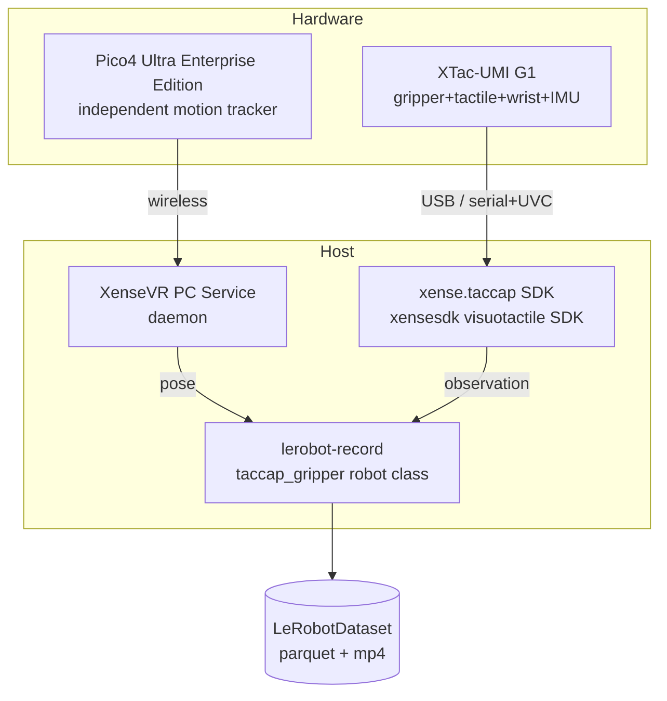

# 1. Overview

## 1.1 What is the XTac-UMI G1

The **XTac-UMI G1** is XenseRobotics'
**handheld UMI leader gripper** for multimodal tactile data collection. A single unit
integrates:

| Part | Notes | Rate |
|---|---|---|
| Motor jaw | **Not powered** during collection; driven by hand | — |
| Encoder | Jaw open angle; after calibration closed = 0, max ~1.7 rad (~97°) | 100 Hz |
| IMU | Accel / gyro / mag / temperature | 100 Hz |
| Two visuotactile sensors (GSPS, one per finger) | Rectified image ~`(400, 700, 3)` | ~30 Hz |
| Wrist camera (XC, UVC) | Wrist-view RGB | ~30 Hz |

!!! warning "The device is passive / self-driven"
    During collection `send_action()` is a **no-op** and the motor is never enabled. The
    operator **mechanically drives the jaw by hand** — so there is **no separate
    teleoperator**, `lerobot-record` allows `teleop=None`, and **no `--teleop.*` flags**
    are needed on the CLI.

## 1.2 System components

A full collection involves four cooperating parts:

## 1.3 Architecture & data flow

`xense.taccap` is a pure **device-access layer** — it does not record datasets. Recording,
time alignment and episode handling live in `xense-taccap-lerobot`.

!!! note "Tactile imaging is at the Python level"
    Since SDK 0.1.4, visuotactile (OG) capture/rectify is **not** in the C++ SDK — it is
    handled by the `xensesdk` visuotactile sensor SDK. `xense.taccap` is **gripper protocol +
    wrist camera** only.

## 1.4 Supported platforms & dependency versions

| Item | Requirement |
|---|---|
| OS | Ubuntu 22.04 (tested); V4L2 + UVC capture path, macOS / Windows unsupported |
| GPU / driver | NVIDIA GPU + driver ≥ 570.144 recommended; enables GPU H.264 hardware encoding and reduces CPU encoding load |
| Python | 3.12 (pinned by v5.1) |
| PyTorch | ≥ 2.2, CUDA 12.8 |
| Gripper SDK | `xense.taccap` ≥ 0.1.0 (`taccap-gripper` PyPI package) |
| Env manager | [Mamba / Miniforge](https://github.com/conda-forge/miniforge) strongly recommended (~10× faster dependency solving than conda) |
| Video codec | `torchcodec` + `av` wheels (v5.1 no longer pins ffmpeg via conda) |

!!! danger "Prerequisites"
    - Your user must be in the `dialout` / `video` groups (see [3.1](03-host-hardware.md#31)).
    - A udev rule to keep ModemManager off the gripper serial is recommended (see [3.2](03-host-hardware.md#32)).

Next → [2. Environment Setup](02-environment.md)
