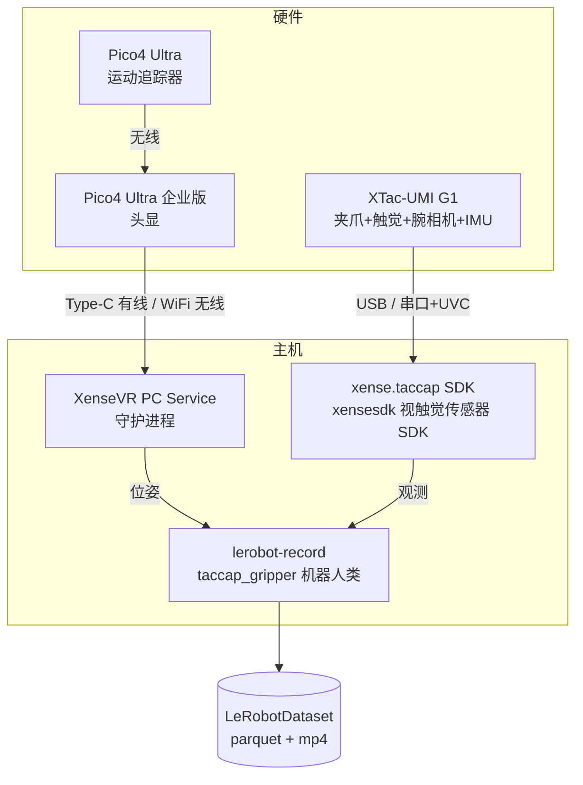

# 1. 概述

!!! abstract "本手册范围"
    覆盖 **从数采夹爪硬件 → 数据落盘为 `LeRobotDataset`** 的完整链路:
    概述/硬件 → 环境安装 → 软件使用采集 → 数据落盘与介绍。
    **模型训练、推理、部署不在范围内。**

## 1.1 XTac-UMI G1 是什么

**XTac-UMI G1** 是 XenseRobotics 的**手持式 UMI 主夹爪**,专为多模态触觉数据采集设计。产品定位为
**面向机器人操作学习的穿戴式视触觉多模态数据采集夹爪**,更多产品价值见 [产品亮点](highlights.md)。
单个夹爪单元集成:

| 部件 | 说明 | 采样率 |
|---|---|---|
| 编码器(Encoder) | 夹爪开合角度,标定后闭合=0、最大 ~1.7 rad(~97°) | 100 Hz |
| IMU | 加速度 / 角速度 / 磁力 / 温度 | 100 Hz |
| 双视触觉传感器(GSPS,左右指各一) | 视触觉图像,校正后约 `(400, 700, 3)` | ~30 Hz |
| 腕部相机(XC,UVC) | 手腕视角 RGB | ~30 Hz |
| 电机夹爪(motor jaw) | **仅从夹爪(Follower)配备**;用于机器人执行端操作或回放 | — |

!!! warning "本设备是被动 / 自驱动的"
    采集时 `send_action()` 是**空操作**,电机永不使能。操作员**手持夹爪机械地**
    带动夹爪走完演示动作——因此**没有独立遥操作端**,`lerobot-record` 允许
    `teleop=None`,命令行上**不需要任何 `--teleop.*` 参数**。

## 1.2 数采系统组成

一次完整采集涉及以下部分协同:



- **夹爪** 通过 `xense.taccap` SDK 读取(串口 `/dev/ttyACM*` + UVC `/dev/video*`)。
- **Pico4 Ultra 运动追踪器**装在夹爪顶部,通过无线与 **Pico4 Ultra 企业版头显**通信。
- **Pico4 Ultra 企业版头显**通过 Type-C 有线网络或 WiFi 无线网络连接数采电脑,将位姿发送至 XenseVR PC Service。
- **XenseVR PC Service** 是位姿数据的主机守护进程,`Pico4TrackerReader` 经 `xensevr_pc_service_sdk` 从中读取 6-DoF 位姿。
- **lerobot-record** 把观测(t-1 帧)与动作(t 帧位姿 + 归一化夹爪开度)配对,写出数据集。

## 1.3 系统架构与数据流

`xense-taccap-lerobot` 负责设备发现、相机采集、观测汇总与数据集录制。`TaccapGripper` /
`BiTaccapGripper` 的 `get_observation()` 直接汇总四路数据来源,再由 `lerobot-record`
完成错帧配对与数据集写入:

```mermaid
flowchart TB
    REC[lerobot-record<br/>self_driven_record_loop] -- 循环调用 --> ROBOT[TaccapGripper / BiTaccapGripper<br/>get_observation]

    MCU[夹爪 MCU<br/>编码器 / 可选 IMU] --> SDK[xense.taccap<br/>串口读取]
    WRIST[腕部 UVC 相机] --> CV[OpenCVCamera<br/>OpenCV + 异步读线程]
    TACT[左右视触觉传感器] --> XS[XenseTactileCamera<br/>xensesdk + 异步读线程]
    PICO[XenseVR PC Service<br/>Pico4 位姿] --> TRACK[Pico4TrackerReader<br/>xensevr_pc_service_sdk]

    SDK --> ROBOT
    CV -- async_read --> ROBOT
    XS -- async_read --> ROBOT
    TRACK --> ROBOT

    ROBOT --> PAIR[错帧配对<br/>obs(t-1) + action(t)]
    PAIR --> DS[(LeRobotDataset<br/>Parquet + MP4)]
```

!!! note "相机数据不经过 xense.taccap"
    - **腕相机流**:`OpenCVCamera` 直接通过 OpenCV / V4L2 采集,后台线程持续更新最新帧。
    - **触觉图像流**:`XenseTactileCamera` 直接通过 `xensesdk` 采集,每个传感器由后台线程异步读取。
    - `get_observation()` 调用各 camera 类的 `async_read()`,将最新图像与夹爪状态、Pico4 位姿汇总成一帧观测。

**每帧最终会记录**:Pico4 Ultra 企业版位姿(`tcp.*`)、归一化夹爪开度(`gripper.pos`)、
可选 IMU、左右触觉图、腕相机图——详见 [5.4 每帧记录内容](05-data-collection.md#54)。

## 1.4 支持的平台与依赖版本

对应参考手册的"支持的平台与系统要求"。

| 项 | 要求 |
|---|---|
| 操作系统 | Ubuntu 22.04/24.04(已验证);采集路径为 V4L2 + UVC,不支持 macOS / Windows |
| GPU / 显卡驱动 | 推荐 NVIDIA GPU + 驱动 ≥ 570.144;可使用 GPU H.264 硬件编码器降低 CPU 编码压力 |
| Python | ≥ 3.10 |
| PyTorch | ≥ 2.2,CUDA 12.8 |
| 夹爪 SDK | `xense.taccap` ≥ 0.1.0(`taccap-gripper` PyPI 包) |
| 环境管理 | 强烈推荐 [Mamba / Miniforge](https://github.com/conda-forge/miniforge)(依赖求解比 conda 快约 10×) |
| 视频编解码 | `torchcodec` + `av` wheel(v5.1 不再用 conda 固定 ffmpeg) |

!!! danger "先决条件"
    - 用户需加入 `dialout`、`video` 用户组(见 [3.1 串口权限](03-host-hardware.md#31))。
    - 建议为夹爪串口配置 udev 规则,避免 ModemManager 抢占(见 [3.2](03-host-hardware.md#32))。

下一步 → [2. 环境部署](02-environment.md)
