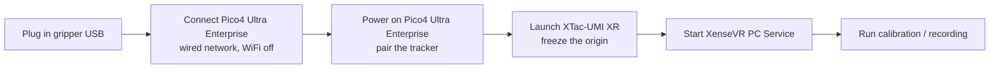

# 3. Host & Device Setup

Corresponds to the reference manual's "robot configuration". A gripper being **listed** is not the
same as it being **openable** — this chapter covers serial permissions, ModemManager contention,
the device auto-discovery rules, and the hardware power-on order.

## 3.1 Serial permissions (dialout) {#31}

The gripper MCU enumerates as `/dev/ttyACM*`, owned by group `dialout`. A user outside that group
can have the SDK *list* grippers but **cannot open the port to read the firmware serial**, so
`scan_grippers()` reports `role=Unknown` with an empty `firmware_sn`, and connecting fails:

```text
RuntimeError: No leader gripper discovered for the left side.
# underneath: IoError: SerialBus: open(/dev/serial/by-id/...): Permission denied
```

Join the group once, then **log back in** for it to take effect:

```bash
sudo usermod -aG dialout "$USER"
# log out and back in (or run newgrp dialout in this shell), then re-plug the gripper
```

Verify — `role` must be `Leader`/`Follower` (not `Unknown`) and `firmware_sn` non-empty:

```bash
python -c "from xense.taccap import scan_grippers
for g in scan_grippers(): print(g.side.name, g.role.name, repr(g.firmware_sn))"
```

!!! warning "Serial still empty?"
    If `firmware_sn` stays empty after fixing permissions, the SN may not be burned in, the serial
    read may still be failing, firmware communication may be faulty, or the device may be
    misconfigured — an empty SN alone is not enough to infer a firmware version. Save the full
    error, retest with a different cable and port, and contact the device or firmware team if it
    persists.

## 3.2 Stop ModemManager grabbing the port (udev) {#32}

!!! info "On the Docker delivery image this is already done"
    `install_customer.sh` installs the udev rule below on the **host** (a container cannot manage
    the host's hot-plug rules). This section stays as the explanation and as a troubleshooting
    reference — you do not need to redo it.

The gripper MCU is a CH343 USB-serial device (`1a86:55d2`, CDC-ACM). On every hot-plug,
**ModemManager** (the default cellular-modem service on Ubuntu/GNOME) probes the fresh port with
AT commands and holds it open for a few seconds, so connecting fails during that window:

```text
IoError: SerialBus: open(/dev/serial/by-id/usb-1a86_USB_Dual_Serial_..-if02): Device or resource busy
```

!!! note "Typical symptom"
    The **first** launch works (the port has settled), but unplug → different USB port → relaunch
    immediately gives **busy**. This is **not** a tactile, camera or bandwidth problem. (If the
    braille driver `brltty` is installed, it grabs `1a86` the same way.) Stopgap: wait ~3 s after
    plugging in.

Permanent fix — a udev rule telling ModemManager to ignore these devices (real modems are
unaffected):

```bash
sudo tee /etc/udev/rules.d/99-taccap-ignore-modemmanager.rules >/dev/null <<'EOF'
# XTac-UMI G1 MCUs are CH343 USB-serial (1a86:55d2) — keep ModemManager off them
ACTION=="add|change", SUBSYSTEMS=="usb", ATTRS{idVendor}=="1a86", ENV{ID_MM_DEVICE_IGNORE}="1"
EOF
sudo udevadm control --reload-rules && sudo udevadm trigger
```

Verify:

```bash
udevadm info -q property -n /dev/ttyACM0 | grep ID_MM_DEVICE_IGNORE   # -> ID_MM_DEVICE_IGNORE=1
mmcli -L                                                               # gripper no longer listed
```

Delete the rule file and reload to revert. (On a dedicated robot host with no cellular module you
can also `sudo systemctl disable --now ModemManager`.)

## 3.3 Device auto-discovery and the odd-left/even-right rule {#33}

Every device is **auto-discovered by serial number + USB topology** and assigned to `left`/`right`
— **no serials are hand-listed**.

### Serial grammar

| Device | Grammar | Example |
|---|---|---|
| Gripper | `TCGU01<batch><line><seq><m\|s>` | `TCGU01A24Z0002m` |
| Tactile | `GSPS01<batch><line><seq>` | `GSPS01A25Z0011` |
| Camera | `XC<batch><line><seq><m\|s>` | `XCA24Z0007m` |

`<seq>` is 4 digits; patch `m` → leader, `s` → follower.

### Side rule (odd-left / even-right)

The **last digit** of the 4-digit sequence: **odd → left, even → right**. This governs gripper and
camera side, and the tactile *finger*.

### Tactile left/right → `{side}_tactile_{left,right}`

Combines USB topology with the side rule:

- **Which gripper (side)**: the two GSPS sensors sharing a gripper's **USB hub** are that
  gripper's pair. That gripper's side is read from its **firmware SN** (the side reported by
  `scan_grippers()`) — **not** the CH343 `mcu_serial`. So: hub → gripper → side.
- **Which finger (left/right)**: the **last digit** of the GSPS serial (odd-left / even-right).

### Pico4 Ultra Enterprise tracker — a different serial system

Tracker serials look like `PC2310MLL3200496G`. **Take the digit before the trailing `G`: odd is
left, even is right.** For `…496G` that is `6` — even, so right. The SN is read from the PC
Service — see [Reading a tracker SN](#pico-tracker-sn).

!!! note "Mis-burned / mis-installed hardware fails explicitly"
    Discovery **fails outright and names** the offending hub/serial when it meets a
    non-conforming serial, the wrong count on a side, two sensors mapping to the same finger, two
    grippers claiming the same tactile side, or a tactile hub with no matching gripper — so the
    physical rig and the fields in your data cannot silently drift apart.

!!! tip "The error names the side with **two**, not the side that came up empty"
    A side coming up empty is **usually because its device's serial put itself on the other
    side**. So discovery reports duplicates first, then gaps, and the gap message tells you how
    many the other side has — go check the digit before the trailing `G` on the **side that has two**,
    rather than hunting for the device that "went missing".

## 3.4 Pico4 Ultra Enterprise setup {#34}

The **standalone motion tracker** that ships with the Pico4 Ultra Enterprise mounts on top of the
gripper and provides the 6-DoF pose. **XTac-UMI XR** (the VR client app) runs on the headset,
and the pose reaches collection via the [XenseVR PC Service](#35). First time through,
follow all five steps: **install → network → bind the tracker → tracking mode and UI → startup
alignment**.

### A pre-configured headset: three things to do {#pico-preconfigured}

A headset configured at the factory already has developer mode, the power policy, the app, the
tracker binding and the tracking mode set — all of it stored on the headset and kept across power
cycles. Before **each** collection session you still need to:

1. **Power the tracker on** — a **short press**; the LED goes solid blue.
2. **[Connect the network](#pico-network)** — plug the USB in and enter the collection host's IP
   in the app. **Every time you re-plug**, and turn the host's WiFi off while collecting.
3. **Work through the [UI checklist](#pico-toolkit-ui)**, then **[align the frame](#pico-frame)** —
   `Send` goes last, and the world origin freezes the moment the app starts, so **do not restart
   the app partway through a dataset**.

Sections below marked "skip on a pre-configured headset" do not apply to you; everything else does.

### First-time XTac-UMI XR install (Pico4 Ultra Enterprise) {#pico-app}

!!! info "Skip this section on a pre-configured headset"
    What this section sets is stored on the headset and survives power cycles. A unit configured at
    the factory needs none of it again — unless it is factory-reset or swapped.

**1. Enable developer mode**: on the headset, Settings → About → tap "Software version" several
times → "Developer options" appears on the left → turn on **USB debugging**.

{ width="520" }

**2. Disable sleep and screen-off**: with developer mode on, go to Enterprise Settings → System
Settings → **Power policy** and set both to "**Never**", **in this order**:

1. **System sleep = Never** first;
2. **Screen off = Never** second.

!!! warning "The order matters"
    The screen-off timeout is bounded by the system sleep timeout. Set screen-off first, while
    system sleep is still at its default, and "Never" gets clamped back to a finite value — it
    looks set but is not in effect. **Sleep first, screen-off second**, then leave Settings and
    come back to confirm both read "Never".

Skipping this: once the headset screen-blanks or sleeps between episodes, **XTac-UMI XR gets
suspended or killed by the system** and tracking drops out. Restarting the XTac-UMI XR re-freezes the
world origin and orientation, leaving poses inside one dataset referenced to different frames
(see [Frame alignment](#pico-frame)). Simply setting the headset down triggers it too, so it must
be turned off — "don't take the headset off" is not a workaround.

!!! note "This lives in Enterprise Settings, not the normal ones"
    "Power policy" is only offered in the **Pico Enterprise** edition's Enterprise Settings; the
    consumer settings menu has no such item and cannot set screen-off to "Never".

**3. Copy the apk**: connect the headset to the PC over USB and copy `XTac-UMI-XR-0.1.0.apk` into
the headset's `Download/` directory.

{ width="520" }

**4. Install**: on the headset, File Manager → Download → `XTac-UMI-XR-0.1.0.apk` → Install → Done. It appears on the headset as **XTac-UMI XR**.

{ width="520" }

### Network connection (important) {#pico-network}

The headset joins the collection PC over a **wired USB shared network**, and tracking data reaches
the XenseVR PC Service through it.

!!! danger "Turn the collection PC's WiFi off while collecting"
    The headset's wired shared network **conflicts with other networks on the PC — WiFi above
    all** (routing and interface contention), leaving the tracker unreachable or its pose
    unstable. **Turn WiFi off on the collection PC for the whole session**, keeping only the
    headset's wired shared network.

Steps:

1. On the headset: Settings → Developer options → enable "USB debugging" → set "USB connection"
   to "**File transfer**".
2. Open **XTac-UMI XR** → tick **"shared network (connect USB first)"** → wait for the headset
   to assign the PC an IP → enter the **PC Service IP** to connect.
3. Start the service on the PC (see [§3.5](#35)): `runService.sh`.

{ width="520" }

### Binding the motion tracker to the headset {#pico-tracker-bind}

!!! info "Skip this section on a pre-configured headset"
    What this section sets is stored on the headset and survives power cycles. A unit configured at
    the factory needs none of it again — unless it is factory-reset or swapped.

**On first use, or after swapping a tracker**, the PICO Motion Tracker must be bound to **this
headset**. Until it is, it cannot be selected in tracking mode, and neither XTac-UMI XR nor the
PC Service will discover its SN.

1. Open the **Motion Tracker** app from the **Library** and go to the **pairing screen**.
2. **Hold the tracker's power button for about 6 seconds**, until the indicator **alternates blue
   and red** — that is Bluetooth pairing mode (steady blue is just powered on, not pairing, and
   the app will not find it).
3. Tap "**Start pairing**" and wait. On success the tracker appears in the "**My trackers**" list
   with its battery level and number (e.g. `Tracker 150399`), marked "**Connected**".
4. **One tracker per gripper — bind both.** The top of the list should read "**2 paired**".

!!! tip "Power-on is a short press; only pairing needs the hold"
    **Everyday power-on** is a **short press** — the LED goes solid blue.
    **Only first-time binding** needs the ~6 s hold until it **alternates blue and red**; the rest
    of the time, do not hold it into pairing mode.

=== "Open the Motion Tracker app"

    { width="440" }

=== "My trackers: 2 paired"

    { width="440" }

!!! note "Binding is one-off; unpair from the ⓘ menu"
    The binding is stored on the headset and survives everyday power cycles and app restarts.
    Re-bind only after swapping trackers, moving to another headset, or a factory reset. When
    **replacing a device**, unpair from the **ⓘ** on the right of the list entry first, then bind
    the new one.

!!! warning "In standalone tracking mode the tracker must stay in the headset's view"
    The app says so itself. A tracker occluded for long by your body, the desk edge or the other
    hand will **lose tracking**, which shows up as pose jumps or a frozen pose. Mind your working
    posture so the tracker on top of the gripper does not leave the headset's view for long.

#### Reading a tracker SN {#pico-tracker-sn}

The SN determines the side (the digit before the trailing `G`, odd-left / even-right — see [3.3](#33)) and is
also how the PC Service identifies a tracker.

This SN is not visible on the headset: the "Motion Tracker" app only shows a **short number** (e.g.
`Tracker 150399`), and the SN on XTac-UMI XR's Network panel (e.g. `PA9410MGL…`) is the
**headset's own**. The **full tracker SN** you need for side matching (shaped like
`PC2310MLL3200496G`) is read with the PC Service's Python interface `xensevr_pc_service_sdk`:

```python
import xensevr_pc_service_sdk as xrt

xrt.init()
print(xrt.get_motion_tracker_serial_numbers())   # e.g. ['PC2310MLL3200496G', ...]
```

!!! warning "Reading SNs needs the whole chain up first"
    `get_motion_tracker_serial_numbers()` reports the trackers the service is **currently
    receiving data from**. So first: tracker bound and powered on → XTac-UMI XR with `Send`
    ticked per the [UI checklist](#pico-toolkit-ui) → [XenseVR PC Service](#35) running on the
    host. Miss any one and you get an empty list.

With the SN in hand you can pin it via `--robot.tracker_serial=<SN>` and skip auto-matching.
**Shake one gripper at a time** to confirm which SN is which hand before writing it into your
config.

### Tracking mode and XTac-UMI XR settings {#pico-tracker}

!!! info "Skip this section on a pre-configured headset"
    What this section sets is stored on the headset and survives power cycles. A unit configured at
    the factory needs none of it again — unless it is factory-reset or swapped.

Once bound:

1. Open "**Motion Tracking**" on the headset.
2. In its settings, set the tracking mode to "**Standalone tracking**".
3. In XTac-UMI XR, set the **PICO Motion Tracker** `Mode` to **`Object`**.

=== "Standalone tracking mode"

    { width="440" }

=== "XTac-UMI XR: Mode = Object"

    { width="440" }

The XenseVR PC Service identifies trackers by **serial number (SN)**; the side is matched
automatically from the digit before the trailing `G`, odd-left / even-right (see [3.3](#33)), or pinned
with `--robot.tracker_serial=<SN>`.

### UI checklist after opening the app {#pico-toolkit-ui}

With the headset on and **XTac-UMI XR** open, work through these four items **in order**. The
PC only receives tracking data once all four are done.

| # | Action | Where | Notes |
|---|------|----------|------|
| 1 | **Network connection** | **Network** panel → tick `Shared network (connect USB first)` → put the PC's IP in `PC Service:` → `Enter` | Once connected, `Status:` turns green **`WORKING`**. Details in [Network connection](#pico-network) |
| 2 | **Set Mode to `Object`** | **Tracking** panel → `PICO Motion Tracker` → `Mode` dropdown | Choose **`Object`** (object tracking), not Head / Controller / Hand. Details in [Tracking mode and XTac-UMI XR settings](#pico-tracker) |
| 3 | **Tick `High-Acc`** | Same row, right of `Mode` | High-accuracy tracking — steadier pose, less jitter |
| 4 | **Tick `Send`** | **Data & Control** section | **Starts pushing** tracking data to the PC. Do this last; before it is ticked the PC reads no pose at all |

{ width="560" }

!!! tip "`Num:` is the count of online trackers"
    `Num:` to the right of `High-Acc` shows how many trackers are connected — a bimanual rig
    should read **`Num: 2`**. A 1 or a 0 means one is off, unbound or disconnected: go back to
    [binding](#pico-tracker-bind) rather than waiting to discover it on the PC side.

!!! warning "`Send` must be ticked last"
    `Send` is the master switch for the data stream: **connect the network, set Mode = `Object`
    and `High-Acc` first, then tick `Send`.** If you change Mode or High-Acc later, **untick and
    re-tick `Send`** so the stream restarts carrying the new settings. No app restart is needed —
    restarting resets the world frame (see [Frame alignment](#pico-frame)).

!!! tip "Self-check: is the PC actually receiving?"
    With all four set, confirm on the host that a pose with an `sn` comes through — via
    `ConsoleDemo` in `/opt/apps/roboticsservice/` or
    `python -m lerobot.robots.taccap_gripper.calibrate_tracker`. If the UI looks connected but the
    PC sees nothing, **check `Send` first**.

### Startup and frame alignment {#pico-frame}

**Wear the headset and face straight towards the robot when you launch XTac-UMI XR**, then
follow the [UI checklist](#pico-toolkit-ui) to enter the PC's IP, select `Object`, and tick
`High-Acc` and `Send`. The moment it launches, the **world frame's origin and orientation are
frozen**.

{ width="520" }

Recorded poses land in a **gravity-aligned world frame**: **+X = straight ahead, +Y = left,
+Z = up**.

!!! warning "Face straight towards the robot at launch"
    Facing straight ahead is what aligns world +X with the robot's forward direction (Y left, Z
    up). **Only the orientation matters** — where you stand (the origin) does not affect later
    use.

!!! warning "Do not restart XTac-UMI XR between episodes"
    A restart changes the origin and orientation for everything recorded afterwards, leaving poses
    inside one dataset referenced to different frames.

- **Pico4 Ultra Enterprise's native frame**: left-handed (X right, Y up, Z inward), origin = the
  headset position at launch.
- **Recording frame**: collection remaps it to the world frame above (X forward, Y left, Z up).

## 3.5 Start the XenseVR PC Service {#35}

The tracker talks to the host's **XenseVR PC Service** (RoboticsService) daemon, which handles
device discovery, status monitoring and live tracking-data distribution. Collection reads poses
from it.

!!! info "On the Docker delivery image the service starts itself"
    The container launches it, so the command below is not needed. When you only work on data and
    do not need the tracker, turn it off with `START_XENSEVR_SERVICE=0` (see
    [2. Environment Setup · Docker](02-environment.md#docker)).

Start it:

```bash
/opt/apps/roboticsservice/runService.sh
```

!!! note "Only one instance at a time"
    The service allows a single instance; starting a second one fails or conflicts.

The service can supply several kinds of tracking data (headset Head / controllers / hand tracking /
full-body mocap / **standalone Tracker**). Collection uses the **standalone Tracker** pose, whose
data carries an `sn` distinguishing the trackers.

!!! note "The headset camera runs through this service too (needs v0.2.0)"
    The [headset camera](05-data-collection.md#57) is not a separate link: the headset sends each
    eye's JPEG to the PC Service as an `0x30` custom message, the service forwards it verbatim to
    the SDK, and `xensevr_pc_service_sdk` caches the newest frame per eye. So **the head camera
    and the trackers share one service and one connection** — no service, neither works.

    v0.1.0 drops `0x30`, so the head camera needs **v0.2.0** (amd64 only; see
    [2.4 One-shot install](02-environment.md) for arm64). The other way round, if you only use
    trackers, v0.2.0 behaves exactly like v0.1.0.

!!! tip "Verifying the service and devices"
    The service directory ships `ConsoleDemo` / `RobotDemoQt` demos
    (`/opt/apps/roboticsservice/`) for confirming the headset was discovered and tracking data
    looks right (they need the same runtime environment as the service).

## 3.6 Hardware power-on order {#36}

!!! note "Startup order"
    The standard order is below (app screens follow whichever version you have):

1. Plug the XTac-UMI G1 into the host (USB).
2. Connect the headset's **wired shared network** and **turn the collection PC's WiFi off**
   (see [3.4 Network connection](#pico-network)).
3. Power on the headset, and **short-press** the tracker's power button until the **blue light comes on**
   (first use needs [binding](#pico-tracker-bind) first).
4. **Facing straight towards the robot**, launch the XTac-UMI XR app (this **freezes the world
   origin and orientation** — see [frames](#pico-frame)), and complete the
   [UI checklist](#pico-toolkit-ui): network → tracker `Object` → `High-Acc` → `Send`.
5. Start the host's XenseVR PC Service (`runService.sh`).
6. Run the calibration / self-check / recording scripts.



!!! warning "An uncalibrated leader is refused at connect"
    `gripper.pos` in the dataset is a normalised opening (`0.0` closed / `1.0` open), and those two
    endpoints come from the **encoder zero** and **travel span** written into MCU flash. **A leader
    with no stored travel span will not connect** — the program exits with the calibration command
    in the error, so there is nothing for you to judge: if it connects, it was calibrated.

    The values live in flash and survive power cycles and host changes. Once per unit is enough;
    this is not a routine step before every session.

    Bimanual rigs especially: **calibrating only one side leaves the two channels on different
    scales**, so the same physical grip reads differently on each side, with nothing in the data
    to show it. If you calibrate one, calibrate both:

    ```bash
    python third_party/taccap-gripper/python/examples/calibrate.py left
    python third_party/taccap-gripper/python/examples/calibrate.py right
    ```

    Full procedure, how to confirm it took effect, and scope →
    [4.1 Gripper calibration (zero + travel span)](04-calibration.md#41)

Next → [4. Calibration & Smoke Test](04-calibration.md)
