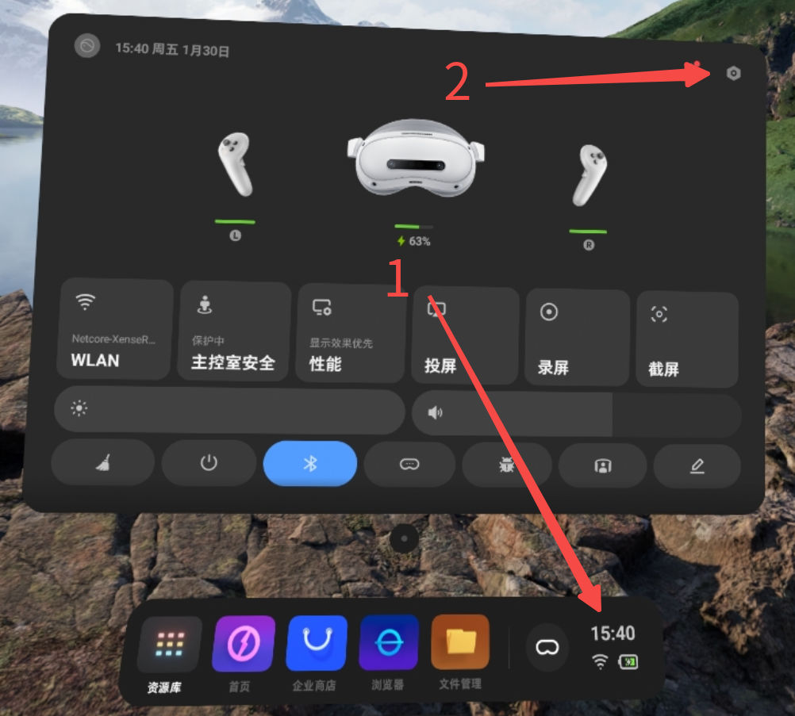
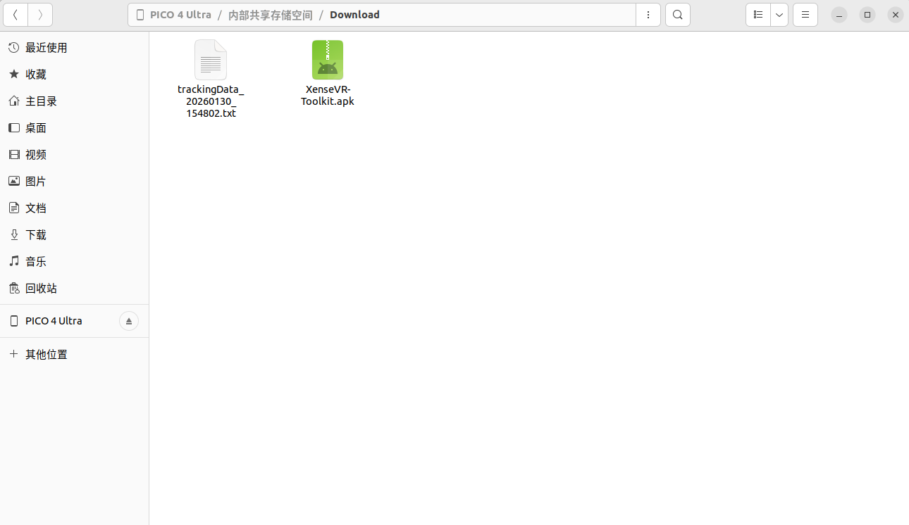
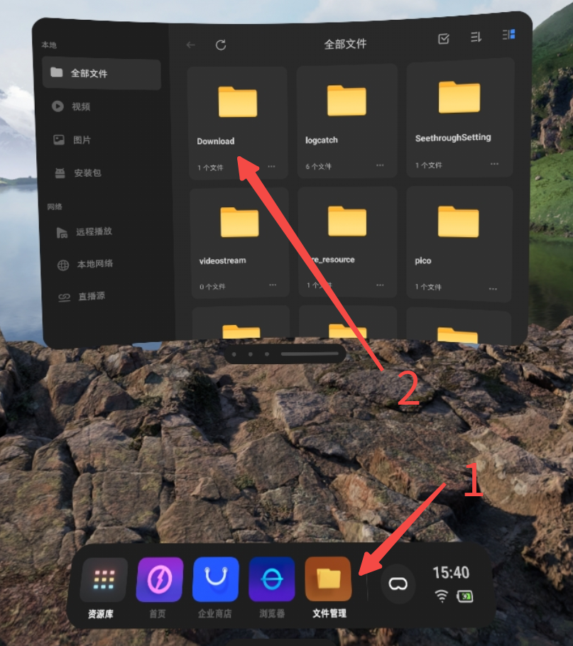
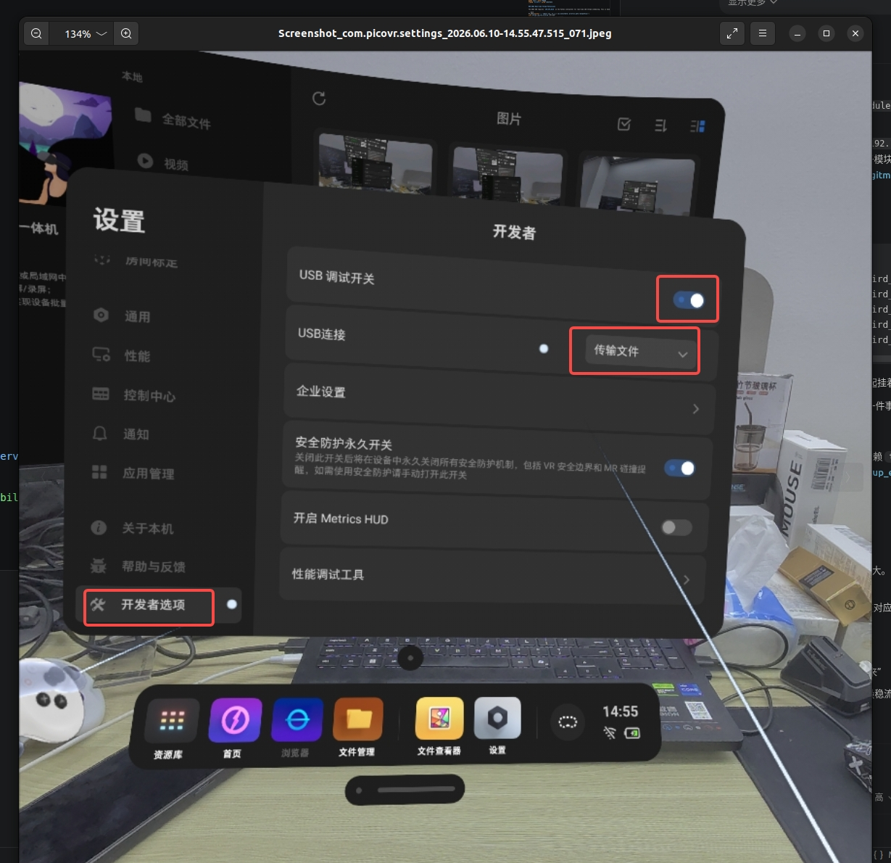
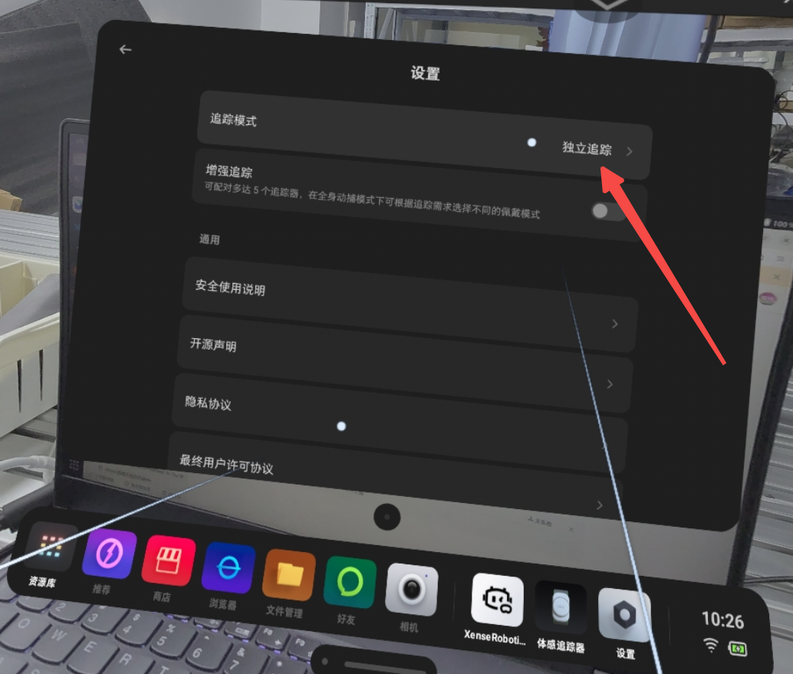
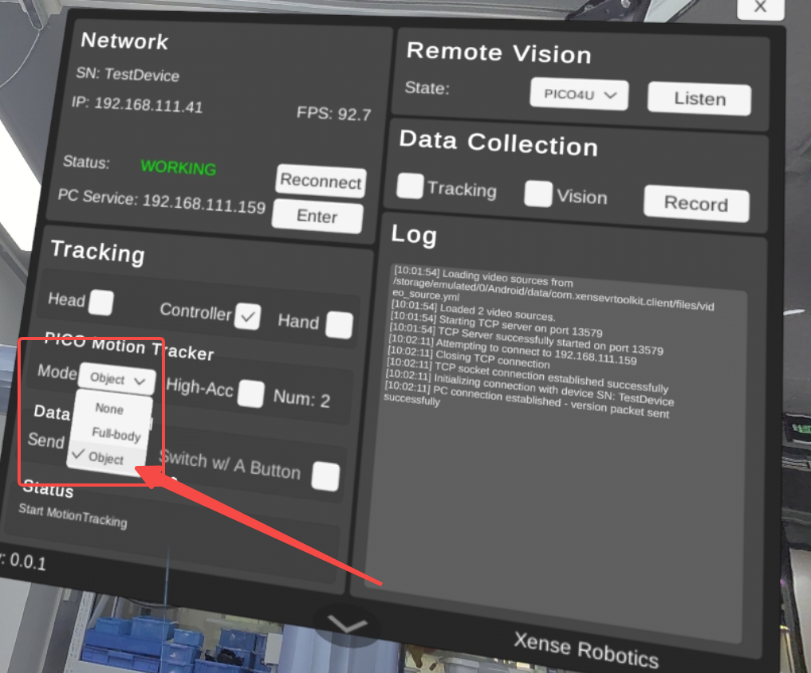
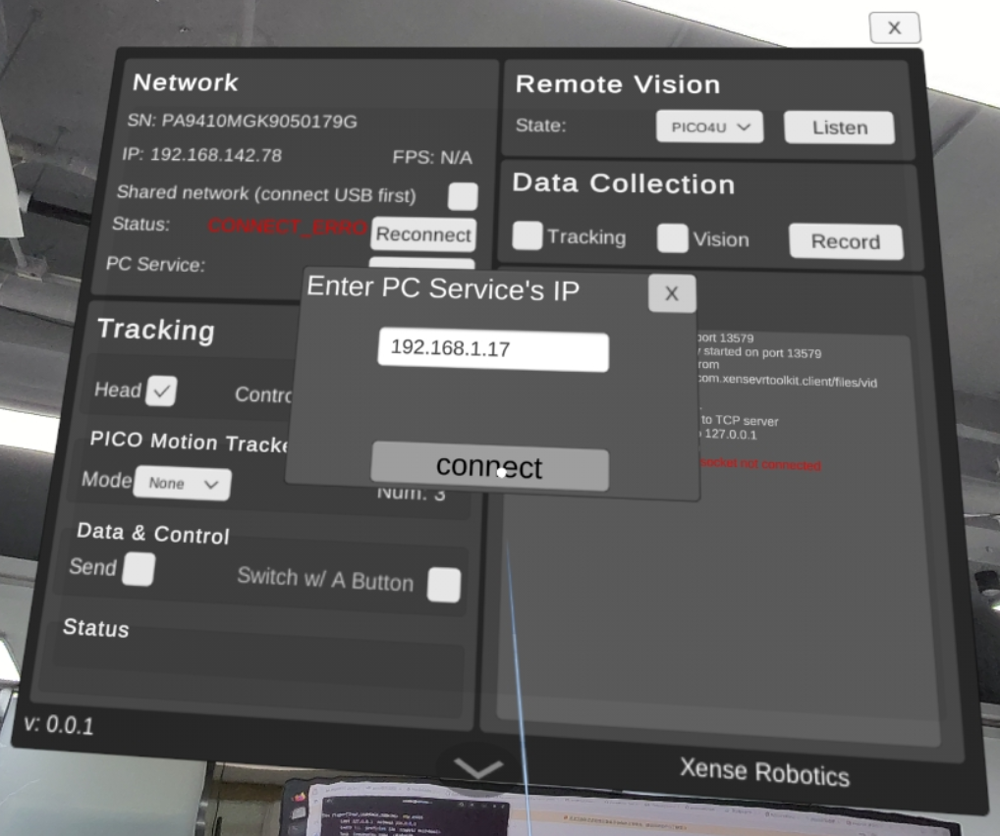

# 3. 主机与硬件配置

对应参考手册的"机器人配置"。夹爪能被**列出**不等于能被**打开**——本章解决串口权限、
ModemManager 抢占、设备自动发现规则,并给出硬件上电顺序。

## 3.1 串口权限(dialout) {#31}

夹爪 MCU 枚举为 `/dev/ttyACM*`,属 `dialout` 组。若用户不在该组,SDK 能*列出*夹爪
但**打不开串口读固件序列号**,于是 `scan_grippers()` 报 `role=Unknown` / `firmware_sn`
为空,`connect()` 失败:

```text
RuntimeError: No leader gripper discovered for the left side.
# 底层实为: IoError: SerialBus: open(/dev/serial/by-id/...): Permission denied
```

一次性加入组,然后**重新登录**使其生效:

```bash
sudo usermod -aG dialout "$USER"
# 注销重登(或当前 shell 执行 newgrp dialout),然后重新插拔夹爪
```

验证——`role` 必须是 `Leader`/`Follower`(不是 `Unknown`),`firmware_sn` 非空:

```bash
python -c "from xense.taccap import scan_grippers
for g in scan_grippers(): print(g.side.name, g.role.name, repr(g.firmware_sn))"
```

!!! warning "序列号仍为空?"
    修好权限后 `firmware_sn` 仍为空,说明设备的 SN 从未烧录(或固件 < V1.6)——
    这是设备/固件问题,不是主机问题。

## 3.2 关闭 ModemManager 抢占(udev) {#32}

夹爪 MCU 是 CH343 USB 串口(`1a86:55d2`,CDC-ACM)。每次热插拔,**ModemManager**
(Ubuntu/GNOME 默认的蜂窝调制解调器服务)会用 AT 指令探测新端口并占用几秒,导致这段
时间内 `connect()` 失败:

```text
IoError: SerialBus: open(/dev/serial/by-id/usb-1a86_USB_Dual_Serial_..-if02): Device or resource busy
```

!!! note "典型症状"
    **第一次**启动正常(端口已稳定),但拔下→换个 USB 口→立即重启就 **busy**。
    这**不是**触觉/相机/带宽问题。(若装了盲文驱动 `brltty`,它也会同样抢占 `1a86`。)
    临时办法:插好后等 ~3 秒再启动。

永久修复——用 udev 规则让 ModemManager 忽略这类设备(不影响真正的调制解调器):

```bash
sudo tee /etc/udev/rules.d/99-taccap-ignore-modemmanager.rules >/dev/null <<'EOF'
# XTac-UMI G1 MCUs are CH343 USB-serial (1a86:55d2) — keep ModemManager off them
ACTION=="add|change", SUBSYSTEMS=="usb", ATTRS{idVendor}=="1a86", ENV{ID_MM_DEVICE_IGNORE}="1"
EOF
sudo udevadm control --reload-rules && sudo udevadm trigger
```

验证:

```bash
udevadm info -q property -n /dev/ttyACM0 | grep ID_MM_DEVICE_IGNORE   # -> ID_MM_DEVICE_IGNORE=1
mmcli -L                                                               # 夹爪不再被列出
```

删除规则文件并重载即可还原。(专用机器人主机若无蜂窝模块,也可
`sudo systemctl disable --now ModemManager`。)

## 3.3 设备自动发现与"单左双右"规则 {#33}

所有设备**按序列号 + USB 拓扑自动发现**并分配到 `left`/`right`,**不手写序列号**。
规则源:`src/lerobot/robots/taccap_gripper/serial_discovery.py`。

### 序列号语法

| 设备 | 语法 | 示例 |
|---|---|---|
| 夹爪 Gripper | `TCGU01<batch><line><seq><m\|s>` | `TCGU01A24Z0002m` |
| 触觉 Tactile | `GSPS01<batch><line><seq>` | `GSPS01A25Z0011` |
| 相机 Camera | `XC<batch><line><seq><m\|s>` | `XCA24Z0007m` |

`<seq>` 为 4 位;patch `m` → Master/Leader,`s` → Slave/Follower。

### 侧别规则(单左双右)

4 位序列号的**最后一位**:**奇数 → 左,偶数 → 右**。适用于夹爪/相机侧别,以及触觉的*手指*。

### 触觉左右 → `{side}_tactile_{left,right}`

结合 USB 拓扑与侧别规则:

- **属于哪个夹爪(side)**:共享同一夹爪 **USB hub** 的两枚 GSPS 传感器就是该夹爪的一对;
  夹爪的侧别读自其**固件 SN**(`scan_grippers()` → `ep.side`,即 `Cmd::GetSn`),
  **不是** CH343 的 `mcu_serial`。即:hub → 夹爪 → 侧别。
- **哪个手指(left/right)**:GSPS 序列号的**最后一位**(单左双右)。

### Pico4 追踪器——另一套序列号

追踪器序列号(如 `PC2310MLL3200496G`)**不是** Xense 序列号。侧别看**倒数第二位**:
奇 → 左,偶 → 右(`pico_tracker_side`),例:`…496G` → `6` → 右。

!!! note "硬件烧错/装错会显式报错"
    每个发现函数在遇到不合规序列号、每侧数量不对、两枚传感器映射到同一手指、
    或触觉 hub 找不到对应夹爪时,都会抛 `ValueError` 并**指名**出问题的 hub/序列号,
    避免物理装配与观测 schema 悄悄漂移。

## 3.4 Pico4 Ultra 配置 {#34}

Pico4 Ultra **独立运动追踪器**装在夹爪顶部,提供 6-DoF 位姿。头显端运行 **XenseVR-Toolkit**
(VR 客户端 APP),位姿经 [XenseVR PC Service](#35) 由 `Pico4TrackerReader` 读取。
首次使用按「**安装 → 网络连接 → 追踪器 → 启动对齐**」四步走。

### 首次安装 XenseVR-Toolkit(头显端) {#pico-app}

**1. 开启开发者模式**:头显内 设置 → 关于本机 → 连续点击「软件版本号」数次 →
左侧出现「开发者选项」→ 打开 **USB 调试**。

{ width="520" }

**2. 拷贝 apk**:用 USB 线连接 Pico4 与电脑,把 `XenseVR-Toolkit.apk` 拷到 Pico4 的 `Download/` 目录。

{ width="520" }

**3. 安装**:头显内 文件管理 → Download → `XenseVR-Toolkit.apk` → 安装 → 完成。

{ width="520" }

### 网络连接(重要) {#pico-network}

Pico4 Ultra 通过 **USB 有线共享网络**接入数采电脑,追踪数据经该网络送到 XenseVR PC Service。

!!! danger "数采时请关闭数采电脑的 WiFi"
    有线 Pico4 共享网络会与电脑上的**其他网络(尤其 WiFi)冲突**(路由/网卡抢占),
    导致追踪器连不上或位姿不稳。**数采期间关闭数采电脑的 WiFi**,只保留 Pico4 的有线共享网络。

连接步骤:

1. 头显内 设置 → 开发者选项 → 打开「USB 调试」→「USB 连接」选择「**传输文件**」。
2. 打开 **XenseVR-Toolkit** → 勾选 **"shared network (connect USB first)"** → 等待 Pico 给
   PC 端分配 IP → 输入 **PC Service 的 IP** 连接。
3. 电脑端启动服务(见 [§3.5](#35)):`runService.sh`。

{ width="520" }

### 配对运动追踪器(Tracker) {#pico-tracker}

1. 头显里打开「**体感追踪**」。
2. 进入设置,追踪模式选「**独立追踪**」。
3. 在 XenseVR-Toolkit 里,把 **PICO Motion Tracker** 的 mode 选为 **object**。

=== "独立追踪模式"

    { width="440" }

=== "Toolkit:mode = object"

    { width="440" }

追踪器由 XenseVR PC Service 按**序列号(SN)**识别;侧别按 SN 倒数第二位奇左偶右自动匹配
(见 [3.3](#33)),或用 `--robot.tracker_serial=<SN>` 直接钉住。

### 启动与坐标系对齐 {#pico-frame}

**戴头显启动 XenseVR-Toolkit 时,面朝机器人正前方**,再输入 PC 端 IP、开启接口。启动瞬间
**冻结世界系的原点与方向**。

{ width="520" }

录制位姿落在**重力对齐的世界系**:**X 正 = 面朝前方,Y 正 = 左,Z 正 = 上**。

!!! warning "启动时必须面朝机器人正前方"
    面朝正前方,世界系 X 轴正方向才对齐机器人正前方(Y 左、Z 上)。**只需对齐方向**;
    站的位置(原点)不影响后续使用。

!!! warning "分集之间不要重启 XenseVR-Toolkit"
    一旦重启,后续录制的原点/方向会变,导致同一数据集内位姿参考系不一致。

- **Pico 原始系**:左手系(X 右、Y 上、Z 里),原点 = 启动时头显 Head 位置。
- **录制系**:`Pico4TrackerReader` 重映射(`pico_to_world=True`)到上述世界系(X 前、Y 左、Z 上)。

## 3.5 启动 XenseVR PC Service {#35}

追踪器与主机的 **XenseVR PC Service**(RoboticsService)守护进程通信;它负责设备发现、
状态监控与实时追踪数据分发,`Pico4TrackerReader` 从它读取位姿。

启动:

```bash
/opt/apps/roboticsservice/runService.sh
```

!!! note "同一时间只能运行一个实例"
    服务进程 `RoboticsServiceProcess` 一次只允许一个实例;重复启动会失败或冲突。

服务可提供多类追踪数据(头显 / 手柄 / 手势 / 全身动捕 / **Tracker 独立追踪**);数采使用的是
**Tracker 独立追踪**位姿,数据中带 `sn` 用于区分不同追踪器。

!!! tip "验证服务与设备"
    服务目录附带 `ConsoleDemo` / `RobotDemoQt` 演示程序(`/opt/apps/roboticsservice/`),
    可用于确认 Pico4 已被发现、追踪数据正常(需与服务相同的运行环境)。

## 3.6 硬件上电顺序 {#36}

!!! note "启动顺序"
    标准启动顺序如下(APP 界面以实际版本为准):

1. 将 XTac-UMI G1 插入主机(USB)。
2. 接好 Pico4 Ultra 的**有线共享网络**,并**关闭数采电脑的 WiFi**(见 [3.4 网络连接](#pico-network))。
3. 开启 Pico4 Ultra 头显,配对运动追踪器。
4. **面朝机器人正前方**,启动 XenseVR-Toolkit APP(**冻结世界系原点与方向**,见 [坐标系](#pico-frame))。
5. 启动主机的 XenseVR PC Service(`runService.sh`)。
6. 运行标定 / 自检 / 录制脚本。


下一步 → [4. 标定与自检](04-calibration.md)
