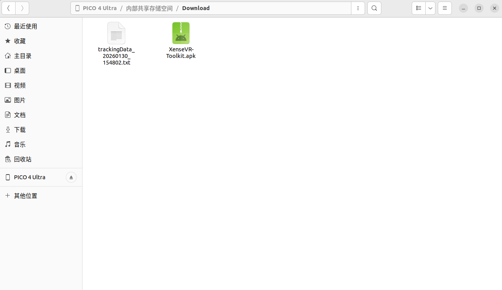
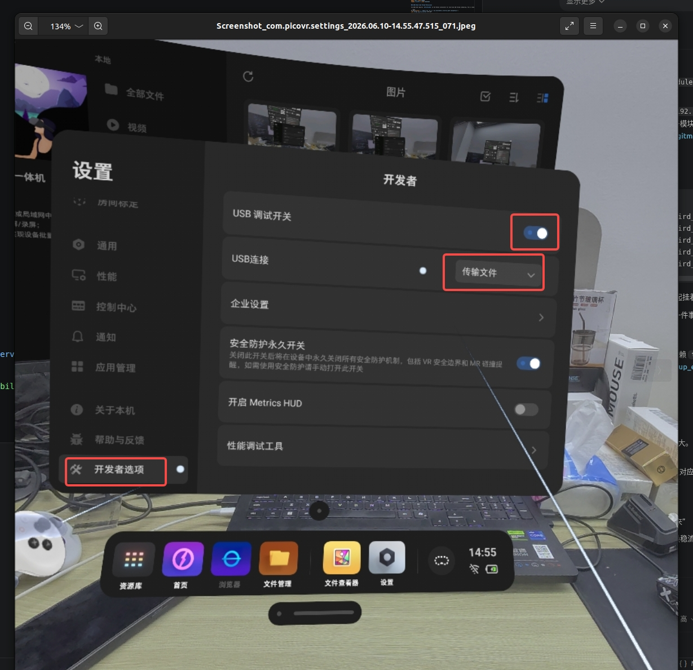
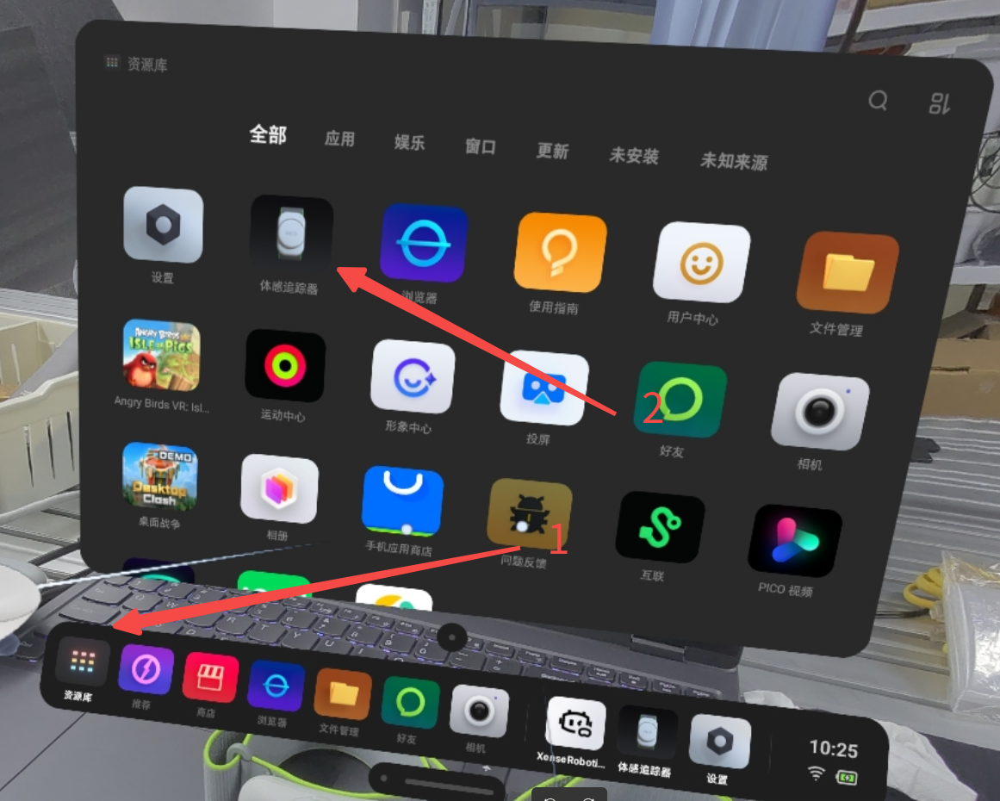
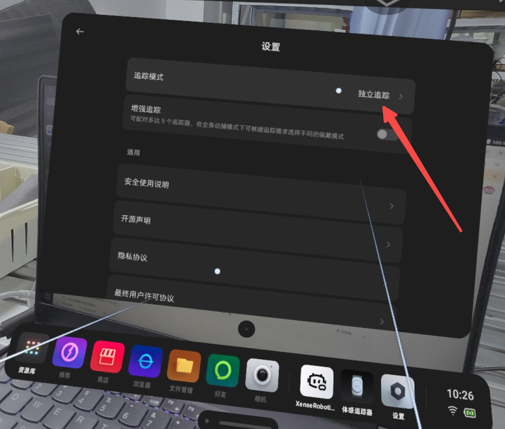
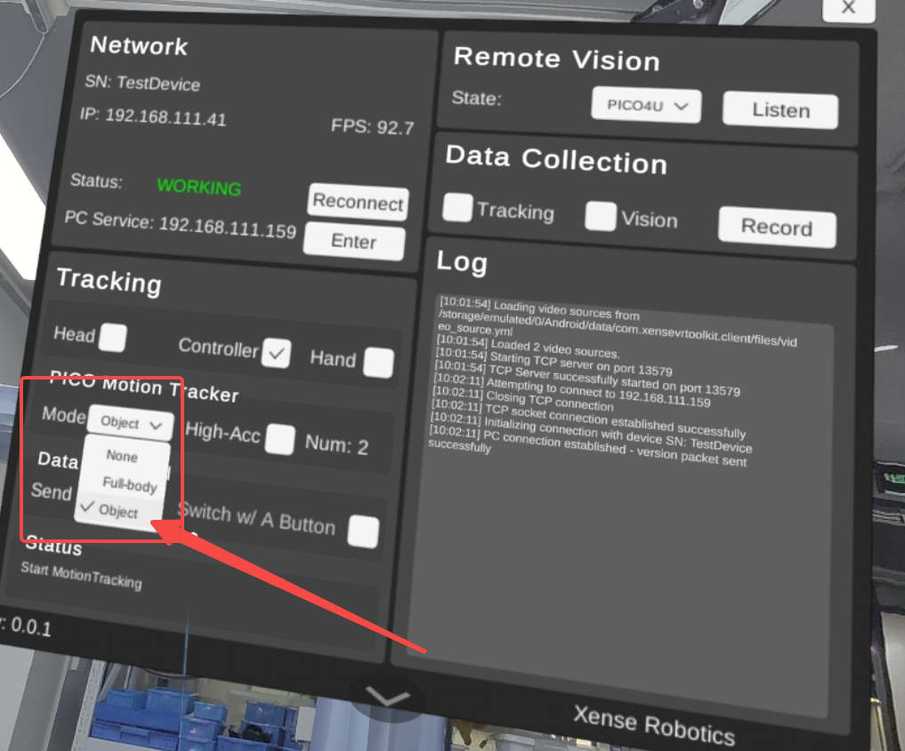
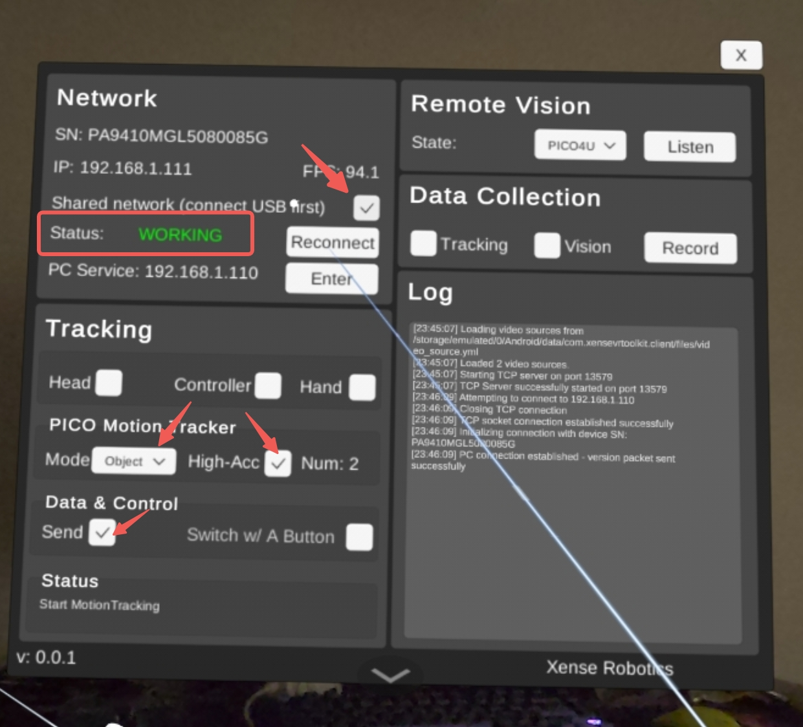
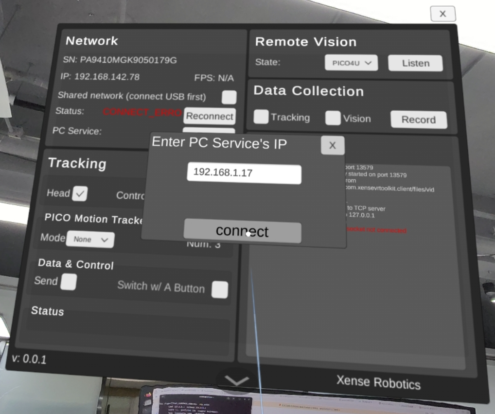
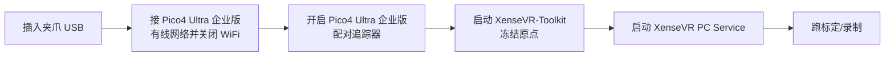

# 3. 主机与硬件配置

对应参考手册的"机器人配置"。夹爪能被**列出**不等于能被**打开**——本章解决串口权限、
ModemManager 抢占、设备自动发现规则,并给出硬件上电顺序。

## 3.1 串口权限(dialout) {#31}

夹爪 MCU 枚举为 `/dev/ttyACM*`,属 `dialout` 组。若用户不在该组,SDK 能*列出*夹爪
但**打不开串口读固件序列号**,于是 `scan_grippers()` 报 `role=Unknown` / `firmware_sn`
为空,连接失败:

```text
RuntimeError: No leader gripper discovered for the left side.
# 底层实为: IoError: SerialBus: open(/dev/serial/by-id/...): Permission denied
```

一次性加入组,然后**重新登录**使其生效:

```bash
sudo usermod -aG dialout "$USER"
# 注销重登(或当前 shell 执行 newgrp dialout),然后重新插拔夹爪
```

验证——`role` 必须是 `Leader`/`Follower`(不是 `Unknown`),`firmware_sn` 非空:

```bash
python -c "from xense.taccap import scan_grippers
for g in scan_grippers(): print(g.side.name, g.role.name, repr(g.firmware_sn))"
```

!!! warning "序列号仍为空?"
    修好权限后 `firmware_sn` 仍为空,可能是 SN 未烧录、串口读取仍失败、固件通信异常或设备端配置问题;不能只根据空 SN 推断固件版本。保存完整报错并换线 / 换口复测,仍异常时联系设备或固件团队。

## 3.2 关闭 ModemManager 抢占(udev) {#32}

!!! info "用 Docker 交付镜像的话本节已经做过了"
    `install_customer.sh` 会把下面这条 udev 规则装到**主机**上(容器管不了主机的热插拔
    规则)。本节留作原理说明和排查参考,不用重做。

夹爪 MCU 是 CH343 USB 串口(`1a86:55d2`,CDC-ACM)。每次热插拔,**ModemManager**
(Ubuntu/GNOME 默认的蜂窝调制解调器服务)会用 AT 指令探测新端口并占用几秒,导致这段
时间内连接失败:

```text
IoError: SerialBus: open(/dev/serial/by-id/usb-1a86_USB_Dual_Serial_..-if02): Device or resource busy
```

!!! note "典型症状"
    **第一次**启动正常(端口已稳定),但拔下→换个 USB 口→立即重启就 **busy**。
    这**不是**触觉/相机/带宽问题。(若装了盲文驱动 `brltty`,它也会同样抢占 `1a86`。)
    临时办法:插好后等 ~3 秒再启动。

永久修复——用 udev 规则让 ModemManager 忽略这类设备(不影响真正的调制解调器):

```bash
sudo tee /etc/udev/rules.d/99-taccap-ignore-modemmanager.rules >/dev/null <<'EOF'
# XTac-UMI G1 MCUs are CH343 USB-serial (1a86:55d2) — keep ModemManager off them
ACTION=="add|change", SUBSYSTEMS=="usb", ATTRS{idVendor}=="1a86", ENV{ID_MM_DEVICE_IGNORE}="1"
EOF
sudo udevadm control --reload-rules && sudo udevadm trigger
```

验证:

```bash
udevadm info -q property -n /dev/ttyACM0 | grep ID_MM_DEVICE_IGNORE   # -> ID_MM_DEVICE_IGNORE=1
mmcli -L                                                               # 夹爪不再被列出
```

删除规则文件并重载即可还原。(专用机器人主机若无蜂窝模块,也可
`sudo systemctl disable --now ModemManager`。)

## 3.3 设备自动发现与"单左双右"规则 {#33}

所有设备**按序列号 + USB 拓扑自动发现**并分配到 `left`/`right`,**不手写序列号**。

### 序列号语法

| 设备 | 语法 | 示例 |
|---|---|---|
| 夹爪 Gripper | `TCGU01<batch><line><seq><m\|s>` | `TCGU01A24Z0002m` |
| 触觉 Tactile | `GSPS01<batch><line><seq>` | `GSPS01A25Z0011` |
| 相机 Camera | `XC<batch><line><seq><m\|s>` | `XCA24Z0007m` |

`<seq>` 为 4 位;patch `m` → leader(主夹爪),`s` → follower(从夹爪)。

### 侧别规则(单左双右)

4 位序列号的**最后一位**:**奇数 → 左,偶数 → 右**。适用于夹爪/相机侧别,以及触觉的*手指*。

### 触觉左右 → `{side}_tactile_{left,right}`

结合 USB 拓扑与侧别规则:

- **属于哪个夹爪(side)**:共享同一夹爪 **USB hub** 的两枚 GSPS 传感器就是该夹爪的一对;
  夹爪的侧别读自其**固件 SN**(即 `scan_grippers()` 输出里的 side),**不是** CH343 的
  `mcu_serial`。即:hub → 夹爪 → 侧别。
- **哪个手指(left/right)**:GSPS 序列号的**最后一位**(单左双右)。

### Pico4 Ultra 企业版追踪器——另一套序列号

追踪器序列号形如 `PC2310MLL3200496G`,**末尾是一个字母**。侧别看**这个字母前面的那一位
数字**(即倒数第二位):**单数为左,双数为右**。
例:`…496G` → `G` 前面是 `6` → 双数 → **右**。
SN 从 PC Service 读取,见 [读取追踪器 SN](#pico-tracker-sn)。

!!! note "硬件烧错/装错会显式报错"
    遇到不合规序列号、每侧数量不对、两枚传感器映射到同一手指、两只夹爪抢同一触觉侧别,
    或触觉 hub 找不到对应夹爪时,设备发现会**直接报错并指明**出问题的 hub/序列号,
    避免实际装配和数据里的字段悄悄对不上。

!!! tip "报错先说「哪一侧挤了两个」,而不是「哪一侧空了」"
    某侧空,**通常是因为它的设备序列号把自己算到了另一侧**。所以发现逻辑先报重复、
    再报缺失,并在缺失的报错里附上「另一侧有几个」的提示——照着**挤了两个的那一侧**
    去查序列号末尾字母前的那位数字,而不是去找那只"不见了"的设备。

## 3.4 Pico4 Ultra 企业版配置 {#34}

Pico4 Ultra 企业版配套的**独立运动追踪器**装在夹爪顶部,提供 6-DoF 位姿。在 Pico4 Ultra 企业版上运行 **XenseVR-Toolkit**
(VR 客户端 APP),位姿经 [XenseVR PC Service](#35) 送到采集端。
首次使用按「**安装 → 网络连接 → 绑定追踪器 → 追踪模式与界面设置 → 启动对齐**」五步走。

### 首次安装 XenseVR-Toolkit(Pico4 Ultra 企业版) {#pico-app}

**1. 开启开发者模式**:在 Pico4 Ultra 企业版内打开 设置 → 关于本机 → 连续点击「软件版本号」数次 →
左侧出现「开发者选项」→ 打开 **USB 调试**。

{ width="520" }

**2. 关闭休眠与灭屏**:开发者模式打开后,进入 企业设置 → 系统设置 → **电源策略**,
按下面的**顺序**把两项都改成「**永不**」:

1. 先设 **系统休眠 = 永不**;
2. 再设 **灭屏(息屏)= 永不**。

!!! warning "顺序不能反"
    灭屏时间受系统休眠时间约束。若先改灭屏,系统休眠仍是默认值,灭屏的「永不」会被
    钳制回一个有限值(表面看已设置,实际未生效)。**先休眠、后灭屏**,改完退出设置再回来
    确认两项都显示「永不」。

不做这一步的后果:头显在采集间隙自动灭屏/休眠后,**XenseVR-Toolkit 会被系统挂起或杀掉**,
追踪数据中断;重启 Toolkit 又会重新冻结世界系原点与方向,导致同一数据集内位姿参考系不一致
(见 [坐标系对齐](#pico-frame))。摘下头显放置时同样会触发,所以必须关掉,不能只靠「别摘头显」。

!!! note "本项在企业设置里,不在普通设置里"
    「电源策略」只在 **Pico 企业版**的「企业设置」中提供;消费版设置菜单里没有这一项,
    也无法把灭屏调到「永不」。

**3. 拷贝 apk**:用 USB 线连接 Pico4 Ultra 企业版与电脑,把 `XenseVR-Toolkit.apk` 拷到 Pico4 Ultra 企业版的 `Download/` 目录。

{ width="520" }

**4. 安装**:在 Pico4 Ultra 企业版内打开 文件管理 → Download → `XenseVR-Toolkit.apk` → 安装 → 完成。

{ width="520" }

### 网络连接(重要) {#pico-network}

Pico4 Ultra 企业版通过 **USB 有线共享网络**接入数采电脑,追踪数据经该网络送到 XenseVR PC Service。

!!! danger "数采时请关闭数采电脑的 WiFi"
    Pico4 Ultra 企业版的有线共享网络会与电脑上的**其他网络(尤其 WiFi)冲突**(路由/网卡抢占),
    导致追踪器连不上或位姿不稳。**数采期间关闭数采电脑的 WiFi**,只保留 Pico4 Ultra 企业版的有线共享网络。

连接步骤:

1. 在 Pico4 Ultra 企业版内打开 设置 → 开发者选项 → 打开「USB 调试」→「USB 连接」选择「**传输文件**」。
2. 打开 **XenseVR-Toolkit** → 勾选 **"shared network (connect USB first)"** → 等待 Pico4 Ultra 企业版为
   PC 端分配 IP → 输入 **PC Service 的 IP** 连接。
3. 电脑端启动服务(见 [§3.5](#35)):`runService.sh`。

{ width="520" }

### 绑定运动追踪器到头显 {#pico-tracker-bind}

**首次使用、或更换追踪器后**,必须先把 PICO Motion Tracker **绑定到这台头显**。
未绑定时,追踪模式里选不到它,XenseVR-Toolkit 与 PC Service 也发现不了对应 SN。

1. 从 **资源库** 打开「**体感追踪器**」App,进入**配对界面**。
2. **长按追踪器电源键约 6 秒**,直到指示灯**蓝红交替闪烁**——这是蓝牙配对状态
   (只亮蓝灯是普通开机,不是配对状态,App 扫不到)。
3. 在配对界面点「**开始配对**」,等待绑定完成;成功后该追踪器出现在「**我的追踪器**」列表里,
   显示电量与编号(如 `Tracker 150399`)并标注「**已连接**」。
4. **两只夹爪各一枚,需要绑定两枚**。列表顶部应显示「**已配对 2 个**」。

!!! tip "长按 6 秒 vs 长按到蓝灯"
    **首次绑定**要长按到**蓝红交替闪烁**(约 6 秒);
    **日常开机**只需长按到**蓝灯亮起**即可,不要按到进配对状态。

=== "打开体感追踪器 App"

    { width="440" }

=== "我的追踪器:已配对 2 个"

    { width="440" }

!!! note "绑定是一次性的;解除配对在 ⓘ 里"
    绑定关系保存在头显上,日常开关机、重启 APP **不需要重绑**;
    更换追踪器、换用另一台头显或头显恢复出厂设置后需要重新绑定。
    **更换设备**时先在列表项右侧的 **ⓘ** 中解除配对,再绑新的。

!!! warning "独立追踪模式下,追踪器必须在头显视野内"
    App 自身也会提示这一点。追踪器被身体、桌沿或另一只手长时间遮挡会**丢跟踪**,
    表现为位姿跳变或卡住。采集时注意作业姿态,别让夹爪顶部的追踪器长时间脱离头显视野。

#### 读取追踪器 SN {#pico-tracker-sn}

SN 决定左右(末尾字母前一位:单左双右,见 [3.3](#33)),也是 PC Service 识别追踪器的依据。

头显里看不到这个 SN:「体感追踪器」App 只显示**短编号**(如 `Tracker 150399`),
XenseVR-Toolkit 的 Network 面板显示的 SN(如 `PA9410MGL…`)是**头显自己的**。
匹配左右要用的**追踪器完整 SN**(形如 `PC2310MLL3200496G`)用 PC Service 的 Python 接口
`xensevr_pc_service_sdk` 读取:

```python
import xensevr_pc_service_sdk as xrt

xrt.init()
print(xrt.get_motion_tracker_serial_numbers())   # 例:['PC2310MLL3200496G', ...]
```

!!! warning "读 SN 需要整条链路先跑起来"
    `get_motion_tracker_serial_numbers()` 报的是**服务当前收到数据的**追踪器。
    所以要先:追踪器已绑定并开机 → XenseVR-Toolkit 按[界面清单](#pico-toolkit-ui)勾上 `Send`
    → 主机已启动 [XenseVR PC Service](#35)。少任一步,返回的会是空列表。

拿到 SN 后可用 `--robot.tracker_serial=<SN>` 直接钉住,跳过自动匹配。
**逐个摇晃夹爪**确认哪个 SN 对应哪只手,再写进配置。

### 追踪模式与 Toolkit 设置 {#pico-tracker}

绑定完成后:

1. 在 Pico4 Ultra 企业版里打开「**体感追踪**」。
2. 进入设置,追踪模式选「**独立追踪**」。
3. 在 XenseVR-Toolkit 里,把 **PICO Motion Tracker** 的 `Mode` 选为 **`Object`**。

=== "独立追踪模式"

    { width="440" }

=== "Toolkit:Mode = Object"

    { width="440" }

追踪器由 XenseVR PC Service 按**序列号(SN)**识别;侧别按 SN 末尾字母前一位单左双右自动匹配
(见 [3.3](#33)),或用 `--robot.tracker_serial=<SN>` 直接钉住。

### 打开 App 后的界面清单 {#pico-toolkit-ui}

戴上头显、打开 **XenseVR-Toolkit** 后,在 APP 界面里**按顺序**完成下面四项;
四项都做完,PC 端才会收到追踪数据。

| # | 操作 | 界面位置 | 说明 |
|---|------|----------|------|
| 1 | **网络连接** | **Network** 面板 → 勾 `Shared network (connect USB first)` → `PC Service:` 填 PC 端 IP → `Enter` | 连上后 `Status:` 显示绿色 **`WORKING`**。详见 [网络连接](#pico-network) |
| 2 | **Mode 选 `Object`** | **Tracking** 面板 → `PICO Motion Tracker` → `Mode` 下拉 | 选 **`Object`**(物体追踪),不是 Head / Controller / Hand。详见 [追踪模式与 Toolkit 设置](#pico-tracker) |
| 3 | **勾选 `High-Acc`** | 同一行,`Mode` 右侧 | 高精度追踪模式,位姿更稳、抖动更小 |
| 4 | **勾选 `Send`** | **Data & Control** 分区 | **开始向 PC 端推送**追踪数据。这是最后一步,勾上之前 PC 侧读不到任何位姿 |

{ width="560" }

!!! tip "`Num:` 就是在线追踪器数量"
    `High-Acc` 右边的 `Num:` 显示当前连上的追踪器个数,**双爪应为 `Num: 2`**。
    只有 1 或 0,说明某枚没开机、没绑定或已断连——先回
    [绑定](#pico-tracker-bind) 排查,不用等 PC 端才发现。

!!! warning "`Send` 必须最后勾"
    `Send` 是数据推送的总开关:**网络连上、Mode = `Object`、`High-Acc` 都设好之后,再勾 `Send`**。
    若中途改过 Mode 或 High-Acc,**取消 `Send` 再重新勾选**,让数据流带着新设置重开;
    不必重启 APP(重启会重置世界系,见 [坐标系对齐](#pico-frame))。

!!! tip "自检:PC 端有没有真的收到"
    四项设好后,在主机上用 `/opt/apps/roboticsservice/` 的 `ConsoleDemo` 或
    `python -m lerobot.robots.taccap_gripper.calibrate_tracker` 确认能读到带 `sn` 的位姿。
    界面看着连上了但 PC 无数据,**首先检查 `Send` 是否漏勾**。

### 启动与坐标系对齐 {#pico-frame}

**佩戴 Pico4 Ultra 企业版启动 XenseVR-Toolkit 时,面朝机器人正前方**,再按
[界面清单](#pico-toolkit-ui)输入 PC 端 IP、选 `Object`、勾 `High-Acc` 与 `Send`。启动瞬间
**冻结世界系的原点与方向**。

{ width="520" }

录制位姿落在**重力对齐的世界系**:**X 正 = 面朝前方,Y 正 = 左,Z 正 = 上**。

!!! warning "启动时必须面朝机器人正前方"
    面朝正前方,世界系 X 轴正方向才对齐机器人正前方(Y 左、Z 上)。**只需对齐方向**;
    站的位置(原点)不影响后续使用。

!!! warning "分集之间不要重启 XenseVR-Toolkit"
    一旦重启,后续录制的原点/方向会变,导致同一数据集内位姿参考系不一致。

- **Pico4 Ultra 企业版原始系**:左手系(X 右、Y 上、Z 里),原点 = 启动时 Pico4 Ultra 企业版 Head 位置。
- **录制系**:采集时会重映射到上述世界系(X 前、Y 左、Z 上)。

## 3.5 启动 XenseVR PC Service {#35}

追踪器与主机的 **XenseVR PC Service**(RoboticsService)守护进程通信;它负责设备发现、
状态监控与实时追踪数据分发,采集端从它读取位姿。

!!! info "用 Docker 交付镜像的话服务会自动启动"
    容器启动时会自己拉起这个服务,不用手动执行下面的命令。只处理数据、用不到追踪器时,
    可以用 `START_XENSEVR_SERVICE=0` 关掉(见 [2. 环境部署 · Docker](02-environment.md#docker))。

启动:

```bash
/opt/apps/roboticsservice/runService.sh
```

!!! note "同一时间只能运行一个实例"
    该服务一次只允许运行一个实例;重复启动会失败或冲突。

服务可提供多类追踪数据(Pico4 Ultra 企业版 Head / 手柄 / 手势 / 全身动捕 / **Tracker 独立追踪**);数采使用的是
**Tracker 独立追踪**位姿,数据中带 `sn` 用于区分不同追踪器。

!!! note "头显相机也走这个服务(需要 v0.2.0)"
    [头显相机](05-data-collection.md#57)的画面不是另一条链路:头显把每只眼的 JPEG 作为
    `0x30` 自定义消息发给 PC Service,服务原样转发到 SDK,由 `xensevr_pc_service_sdk` 缓存
    最新帧。所以**头显相机和追踪器共用同一个服务、同一条连接**——服务没起来,两者都没有。

    v0.1.0 会丢弃 `0x30`,必须升到 **v0.2.0**(仅 amd64;arm64 的说明见
    [2.4 一键安装](02-environment.md))。反过来,只用追踪器时 v0.2.0 与 v0.1.0 行为一致。

!!! tip "验证服务与设备"
    服务目录附带 `ConsoleDemo` / `RobotDemoQt` 演示程序(`/opt/apps/roboticsservice/`),
    可用于确认 Pico4 Ultra 企业版已被发现、追踪数据正常(需与服务相同的运行环境)。

## 3.6 硬件上电顺序 {#36}

!!! note "启动顺序"
    标准启动顺序如下(APP 界面以实际版本为准):

1. 将 XTac-UMI G1 插入主机(USB)。
2. 接好 Pico4 Ultra 企业版的**有线共享网络**,并**关闭数采电脑的 WiFi**(见 [3.4 网络连接](#pico-network))。
3. 开启 Pico4 Ultra 企业版,长按追踪器电源键至**蓝灯亮起**(首次使用需先[绑定](#pico-tracker-bind))。
4. **面朝机器人正前方**,启动 XenseVR-Toolkit APP(**冻结世界系原点与方向**,见 [坐标系](#pico-frame)),
   并按 [界面清单](#pico-toolkit-ui) 完成:连网络 → tracker 选 `Object` → 勾 `High-Acc` → 勾 `Send`。
5. 启动主机的 XenseVR PC Service(`runService.sh`)。
6. 运行标定 / 自检 / 录制脚本。


```mermaid
flowchart LR
    A[插入夹爪 USB] --> N[接 Pico4 Ultra 企业版<br/>有线网络并关闭 WiFi]
    N --> B[开启 Pico4 Ultra 企业版<br/>配对追踪器]
    B --> C[启动 XenseVR-Toolkit<br/>冻结原点]
    C --> D[启动 XenseVR PC Service]
    D --> E[跑标定/录制]
```

!!! warning "主夹爪没标定的话,采集程序会拒绝连接"
    数据集里的 `gripper.pos` 是归一化开度(`0.0` 闭合 / `1.0` 张开),这两个端点来自写在
    MCU flash 里的**编码器零点**和**行程上限**。**没标过行程上限的主夹爪连不上**,程序会
    带着标定命令报错退出——所以不用自己判断该不该标,能连上就是标过了。

    标定值存在 flash 里,断电不丢、换主机也不用重标,一台标一次就够,不是每次开录的例行步骤。

    双臂尤其注意:**只标一侧会让左右两条通道落在不同刻度上**,同一个握持动作左右读数不同,
    而数据里看不出任何异常。要标就两侧都标:

    ```bash
    python third_party/taccap-gripper/python/examples/calibrate.py left
    python third_party/taccap-gripper/python/examples/calibrate.py right
    ```

    完整步骤、如何确认生效、适用范围 → [4.1 夹爪标定(零点 + 行程)](04-calibration.md#41)

下一步 → [4. 标定与自检](04-calibration.md)
