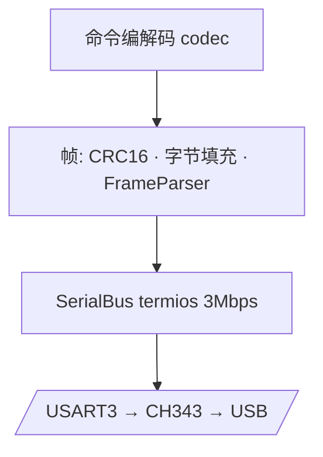

# 嵌入式与固件

XTac-UMI G1 主控固件(TC-GU-01)与通信协议。

!!! warning "内容待汇总"
    完整固件资料(协议手册、命令全集、寄存器/参数、烧录与量产流程)由嵌入式团队汇总中。
    本页先给出**SDK 侧已确认**的协议与运行时事实作为框架,其余标注「待补」。

## 主控

- **MCU**:STM32H562,实时系统 **ThreadX**。
- **对上通信**:USART3 @ 3 Mbps(经 CH343 转 USB)。
- **对下通信**:FDCAN1 @ 1 Mbps(透传灵足电机,从爪)。

## 通信协议(TC-GU-01)

| 层面 | 版本 | 要点 |
|---|---|---|
| 帧格式(wire framing) | **V1.8** | HEAD..PAYLOAD 之间字节填充(byte-stuffing);CRC16(modbus)对未填充数据计算 |
| 命令集(command set) | **V1.7** | OTA、磁校准(MagCal)、KeyStatus、传感器错误、电机 / CAN-id / 夹爪配置 |

- 传输层:异步 `Transport`,后台读线程 + ACK 匹配(seq→promise),每命令 DATA 订阅。
- SDK 的 `commands.hpp` / `payloads.hpp` 与固件 `protocol_cmd.h` / `protocol_data.h`
  **1:1 对应**,并用 `static_assert(sizeof(...)==N)` 在编译期锁定布局。

## 数据流与采样率

| 数据源 | 请求速率 | 实测 | 说明 |
|---|---|---|---|
| IMU | 100 Hz | ~100 Hz | 固件对唯一数据帧速率有上限,即使请求更高也受限 |
| 编码器 | 100 Hz | ~100 Hz | 同上 |
| 电机状态 | — | — | 从爪相关 |

!!! note "固件流去重"
    固件侧任务(`task_data_stream.c` / `task_imu.c` / `task_encoder.c`)决定了
    唯一数据速率的上限;详细行为以嵌入式团队协议手册为准(*待补*)。

## OTA 固件升级

- SDK 通过 `OtaSession` 提供 OTA;CLI 见 [SDK 示例 → `ota_update.py`](sdk-examples.md)。

!!! danger "OTA 有风险"
    刷错固件会**变砖 MCU**。务必核对目标固件与设备型号,谨慎操作。

## 日志

- SDK 使用单例 spdlog logger(`xense.taccap`),C++ 与 Python 共享。
- 文件日志目录:`$TACCAP_LOG_DIR` 或默认 `~/.taccaplogs/`,每次进程一份
  `session_YYYYMMDD_HHMMSS.log`,最多保留 10 份。

## 待补

- 完整命令集与载荷字段表
- 磁校准 / KeyStatus / 传感器错误码
- 量产烧录与 SN 烧录流程
- 版本兼容矩阵(固件 ↔ SDK)
