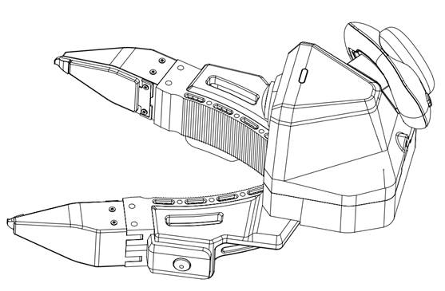
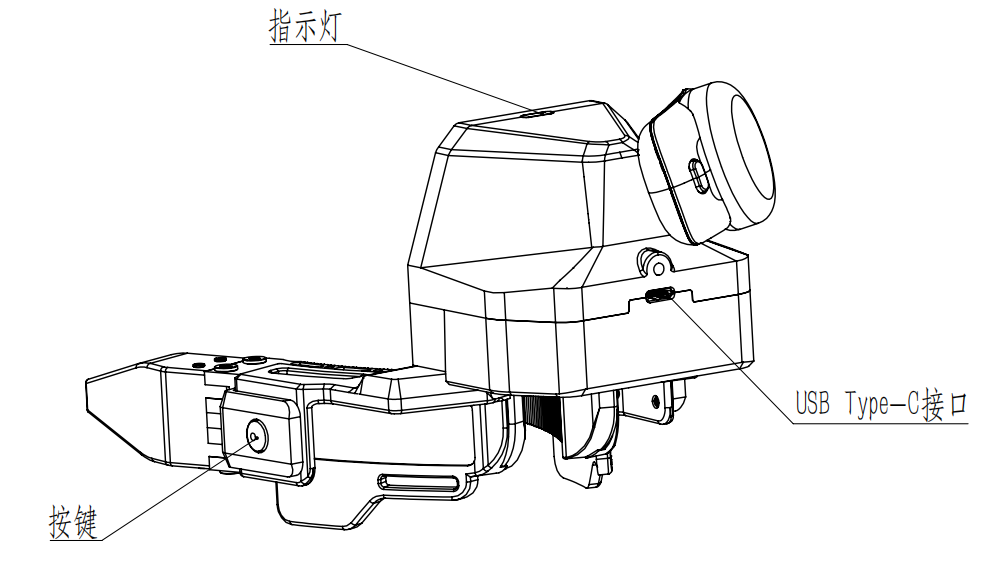
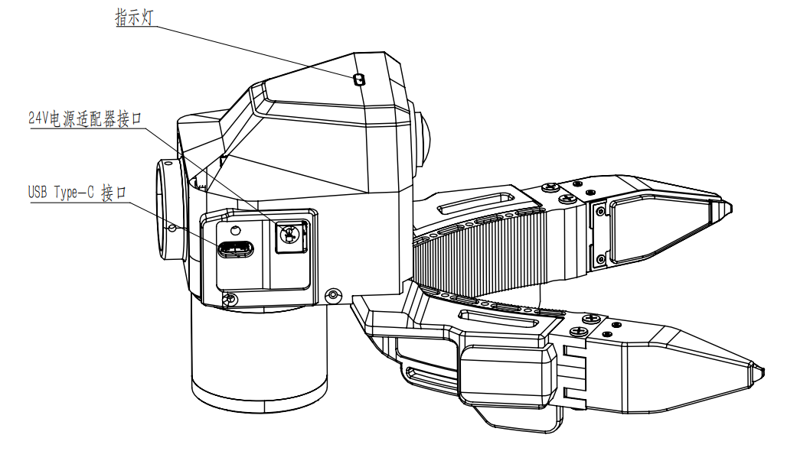
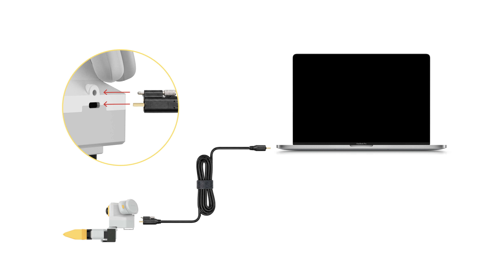
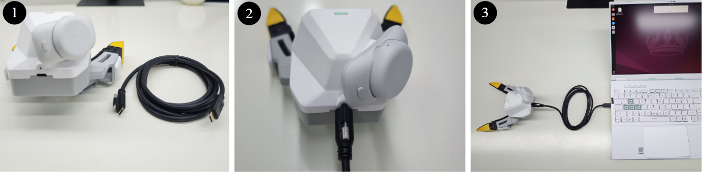
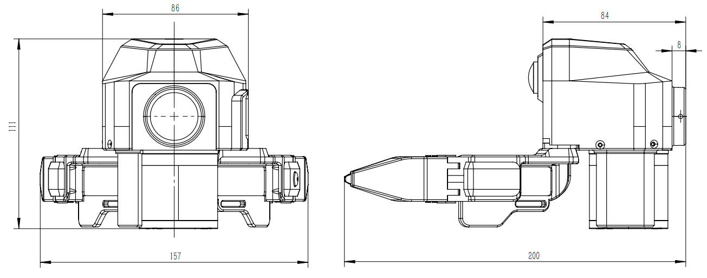
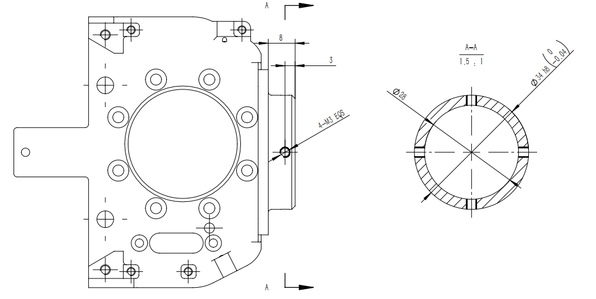
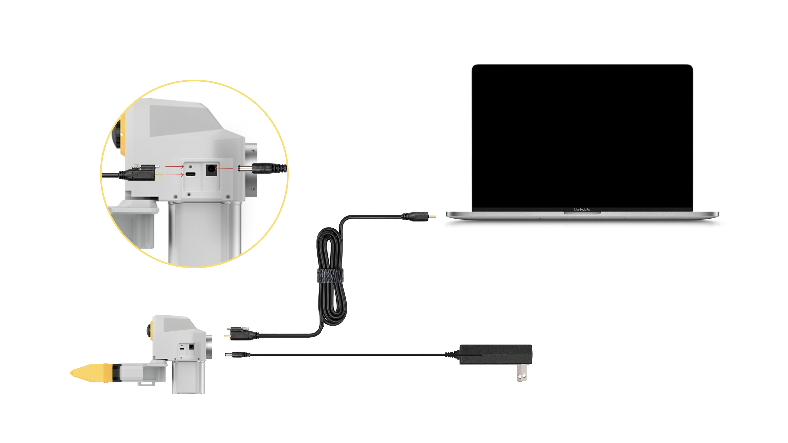
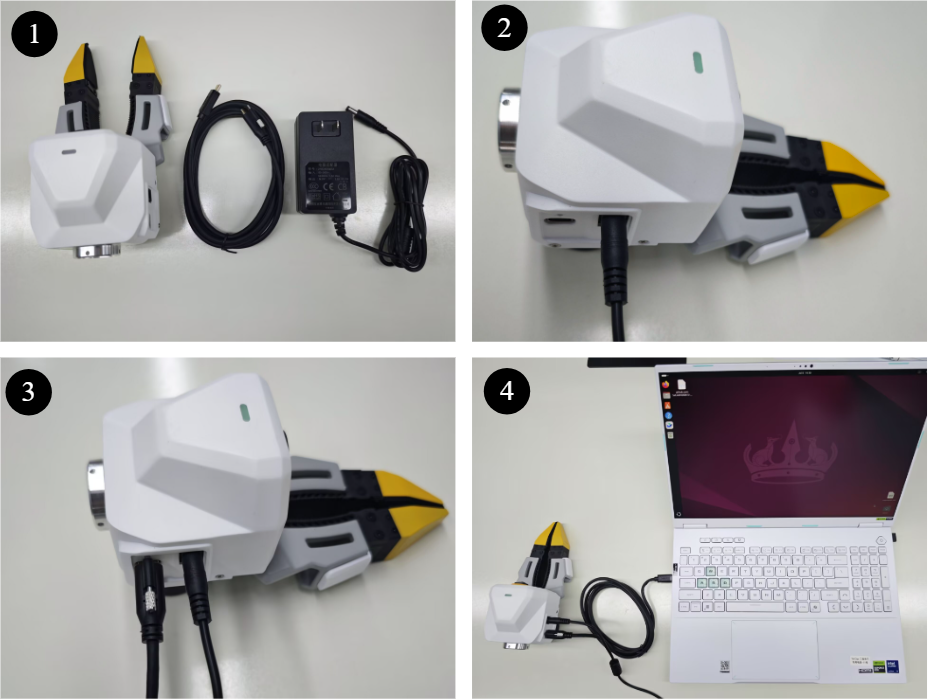
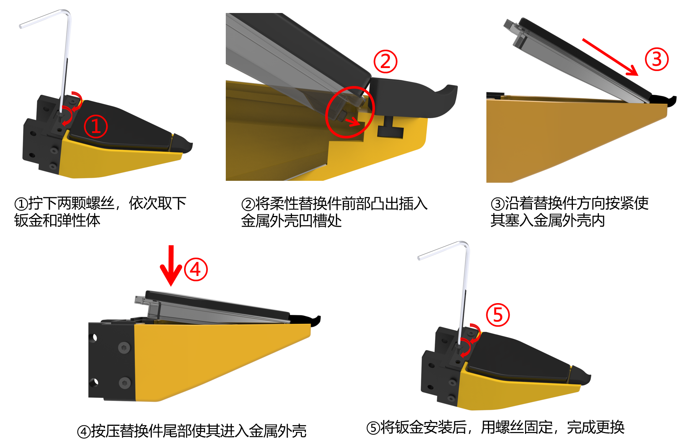

# 硬件介绍

XTac-UMI G1 的机械、电气与操作说明,面向数采使用的
**设备了解与连接上手**。连接、上电或拆装前请先阅读文末 [安全须知](#safety)。

## 产品组成

| 部件 | 说明 |
|---|---|
| 主夹爪(区分左右) | 人手侧操作与数据采集;左右按标识区分;Type-C 统一供电+通信 |
| 从夹爪(不区分左右) | 安装于机器人末端,用于执行端操作或回放;24V 供电 + Type-C 通信 |
| 视触觉传感器 ×2 | 左右指各一,三色光视触觉成像 |
| 腕部鱼眼相机 | 手腕视角 RGB,超大视场角 |
| PICO 头显 + Pad | 头显用于头部视角与主爪轨迹提取;Pad 用于任务操作/状态查看(见 [3.4 Pico4 配置](03-host-hardware.md#34)) |
| 主控 MCU(TC-GU-01) | STM32H562 + ThreadX |

!!! note "包装清单以随货为准"
    标准系统配置(线缆、电源适配器、采集终端等)以**合同配置及随货发货清单**为准;
    缺少关键线缆/电源/终端时请联系项目负责人或技术支持,勿自行替代。

### 主夹爪(区分左右)

=== "左主夹爪"

    { width="360" }

=== "右主夹爪"

    { width="360" }

主夹爪的电源与通信统一通过 USB Type-C 完成;**按键**用于录制控制,**指示灯**用于判断运行状态。

{ width="480" }

### 从夹爪(不区分左右)

{ width="360" }

从夹爪安装在机器人末端,当前硬件不区分左右;安装时注意法兰方向、线缆走线与机器人运动空间。

## 主夹爪连接与使用 {#install}

### 连接前检查

- 备齐:左/右主夹爪、两根 **USB Type-C to Type-C 锁紧线**、笔记本/数采终端。
- 确认**未使用 9V/12V 快充适配器**直连主夹爪。
- 检查 Type-C 锁紧端完好、夹爪接口内无异物。
- 检查视触觉传感器表面无污渍、划伤、松动、异物。

### 连接步骤

主夹爪与上位机的连接关系:

{ width="560" }

1. 取出 USB Type-C 通讯线。
2. 连接主夹爪本体端的 Type-C 接口,**旋紧锁紧螺钉**。
3. 另一端接数采终端的 Type-C 口,在采集软件中确认主夹爪通信正常。

{ width="480" }

### 上电与识别

主夹爪**无需单独电源**,供电与通信都走 Type-C。连接后观察指示灯,并在采集软件中确认左右主夹爪识别正常。

**用 `lsusb` 核对传感器**:接线完毕后运行 `lsusb`,确认能看到全部 UVC 传感器——
**双臂**应有 **6 个**:2 个腕部相机(wrist camera)+ 4 个视触觉传感器(每只主爪 1 相机 + 2 触觉);
**单臂** 3 个(1 相机 + 2 触觉)。

```bash
lsusb
```

数量不对时,检查线缆是否锁紧、USB 口是否接触良好;排查见 [异常排查](#troubleshoot)。

### 指示灯状态 {#buttons-leds}

!!! warning "功能开发测试中"
    以下指示灯状态目前**尚在开发测试中**,实际行为以最终发布版本为准。

| 指示灯 | 含义 | 用户动作 |
|---|---|---|
| 绿色长亮 | 运行中 | 已上电,正常运行 |
| 绿色闪烁 | 正在录制 | 保持操作,避免断电/拔线 |
| 红色闪烁 | 故障 | 停止录制,按[异常排查](#troubleshoot)检查 |
| 蓝色闪烁 | OTA 升级中 | 升级期间**不要断电/拔线** |

### 按键功能

!!! warning "功能开发测试中"
    以下按键功能目前**尚在开发测试中**,实际行为以最终发布版本为准。

| 按键 | 动作 | 功能 | 场景 |
|---|---|---|---|
| 主爪左键 | 单击 | **开始录制** | 准备完成后开始采集 |
| 主爪左键 | 双击 / 长按 | 用户自定义 | 按项目软件配置 |
| 主爪右键 | 单击 | 切换下一流程 | 当前步骤完成 |
| 主爪右键 | 双击 | 重新录制当前回合 | 回合失败/操作错误/数据异常 |
| 主爪右键 | 长按 | 退出当前录制 | 需中断录制时 |

!!! note "与软件采集的联动"
    按键为**设备侧定义**;与 `lerobot-record` 的具体联动以实际集成为准,采集操作见 [数据采集](05-data-collection.md)。

## 从夹爪安装与连接

### 安装前检查

- 确认机器人已停机、处于安全姿态。
- 确认末端法兰尺寸、螺钉规格、安装方向与末端负载满足项目要求。
- 确认 24V 适配器、Type-C 通信线与锁紧结构完好。
- 规划线缆走线,避免与关节/夹爪运动区/障碍物干涉。

### 法兰安装

从夹爪通过法兰安装到机器人末端(尺寸/孔位见下图)。

=== "法兰安装"

    { width="420" }

=== "法兰尺寸"

    { width="420" }

### 电源与通信连接

从夹爪**通信与供电分开**:通信走 Type-C,供电用 24V 适配器。

{ width="560" }

1. 取出 USB Type-C 通讯线、24V 电源适配器。
2. 连接从夹爪本体端的 **24V 电源适配器**。
3. 将 Type-C 锁紧线带螺钉的一端接从夹爪本体,**旋紧锁紧螺钉**。
4. 另一端接数采终端,在软件中确认从夹爪通信正常。

{ width="480" }

!!! warning "线缆与安装检查"
    确认从夹爪固定牢靠、24V 连接可靠、Type-C 已锁紧并留足余量;线缆不会在机器人运动中被拉扯/弯折/缠绕。
    **首次运行前建议低速测试**,确认无干涉。

## 视触觉传感器维护与拆装

{ width="480" }

- 表面有灰尘时用**无尘布**轻拭。
- **不要**用尖锐物刮擦表面;不要让胶水/油污/金属碎屑/腐蚀性液体接触表面。
- 拆装后若图像质量明显下降,检查传感器是否压紧、有无污渍,或**重新标定**。

更多保养见 [维护保养](maintenance.md)。

## 上电与下电顺序

| 设备 | 供电 | 上电顺序 | 下电顺序 |
|---|---|---|---|
| 主夹爪 | USB Type-C,DC 5V/500mA | 先连夹爪端并锁紧,再连数采终端 | 先拔数采终端端,再松螺钉拔夹爪端 |
| 从夹爪 | 24V 适配器 + Type-C | 先连 24V 电源,再连 Type-C 并锁紧 | 先拔数采终端端,再断 24V,最后拔夹爪端 Type-C |

上电后观察指示灯并在软件确认识别正常;下电前先**停止当前采集/录制/机器人运动/回放**。

!!! warning "静电与异常"
    上下电注意防静电。若出现异常重启、无法识别或红灯闪烁,立即停止并按[异常排查](#troubleshoot)处理。

## 序列号与左右识别 {#sn}

设备的**左右侧别**由序列号**流水号末位的单双数**区分:**单数 = 左,双数 = 右**(单左双右)。
采集软件据此**自动分侧**(见 [3.3 设备发现规则](03-host-hardware.md#33)),通常无需手动辨别。

需要手动核对时,`lsusb` 能看到 **XC 鱼眼相机**与**视触觉传感器**的序列号,按末位单双数即可判断左右。

## 技术参数 {#specs}

### 电气与接口

| 项目 | 主夹爪 | 从夹爪 |
|---|---|---|
| 供电 | USB Type-C | 24V 电源适配器 |
| 通信 | USB Type-C | USB Type-C |
| 标准供电规格 | DC 5V/500mA | 24V |
| 线缆 | 配套 Type-C to Type-C 锁紧线 | Type-C 通信线 + 24V 电源线 |
| 禁止事项 | 禁止 9V/12V 快充直连 | 禁止供电规格不匹配/带故障电源 |

### 产品规格(整机)

参数以**官方最新资料为准**。采集时实际速率可按需配置(如触觉以较低帧率录制),属**使用选择**,不改变传感器规格。

| 参数项 | 规格 |
|---|---|
| 夹爪类型 / 外形 | 二指结构;145 × 186 × 170 mm |
| 重量(主爪)/ 负载 | 约 370 g;最大 2.5 kg |
| 开合行程 / 角度 | 0–150 mm / -9° 至 +50° |
| 续航 | 3 小时,或电源适配器 |
| 多设备时间同步 / 定位 | 5 ms;< 3 mm |
| 视触觉 | 2 × 三色光,量程 0–25 N,120 FPS(640×480 MJPG) |
| IMU | 9 轴,200 Hz |
| 腕部鱼眼相机 | FOV 190°;1920×1080 @ 60 FPS MJPG |
| 输出数据 | RGB、多模态触觉、夹爪开口角度、IMU、空间定位轨迹 |

!!! note "内部通信(技术参考)"
    对外接口为 USB Type-C;内部 MCU 串口经 CH343(`1a86:55d2`)桥接,枚举 `/dev/ttyACM*`,
    USART3 @ 3 Mbps;视触觉与腕相机为 UVC(`/dev/video*`);从爪经 FDCAN1 @ 1 Mbps 透传灵足电机。

## 异常排查 {#troubleshoot}

先记录「设备型号/编号、连接方式、指示灯状态、软件报错、现场照片」,再按下表排查;软件类问题见 [故障排查](troubleshooting.md)。

| 现象 | 可能原因 | 处理 |
|---|---|---|
| 指示灯不亮 | 线缆未插紧/供电不足/接口损坏 | 重插线缆、确认配套 Type-C、换终端接口;仍异常则停用 |
| 软件识别不到主夹爪 | USB 异常/线缆故障/软件未刷新 | 检查左右连接、重开采集软件、换 Type-C 接口或线缆 |
| 红色闪烁 | 设备故障/通信异常 | 停止录制并重新上电;反复出现则联系技术支持(附灯态与日志) |
| 图像黑屏/无图像 | UVC 未识别/传感器连接异常/通道选错 | 检查系统是否识别 UVC、重启采集软件、重新上电 |
| 图像污点/模糊 | 表面污渍/异物/损伤 | 无尘布清洁;有划伤/凹陷需更换传感器 |
| 录制过程中断 | 线缆松动/接触不良/供电不稳 | 检查锁紧螺钉、避免线缆受力、重录当前回合 |
| 从夹爪不上电 | 24V 未连接/适配器异常 | 检查 24V 适配器、插座、电源接口与规格 |
| 从夹爪通信异常 | Type-C 未连/未识别/线缆干涉 | 重连 Type-C、检查机器人运动是否拉扯线缆 |
| OTA 蓝灯过久 | 升级未完成/流程异常 | 升级期间勿断电;长时间无变化按 OTA 指引并联系支持 |

!!! danger "严重异常"
    若发生异味、冒烟、明显发热、结构破损或线缆破皮,**立即断电并停止使用**。

## 安全须知 {#safety}

!!! danger "连接 / 上电 / 拆装前必读"
    | 风险项 | 要求 | 后果 |
    |---|---|---|
    | 主夹爪供电 | 仅用配套 USB Type-C 线连数采终端,**DC 5V/500mA** | 规格不符可能损坏设备 |
    | 禁止快充直连 | **禁止 9V/12V 快充适配器直连主夹爪** | 可能烧毁控制板 |
    | 从夹爪供电 | 供电与通信分开,供电用 **24V 适配器** | 电源接错可能损坏硬件 |
    | 线缆插拔 | 插拔带锁紧螺钉的 Type-C 前先停止采集;拔出前先松螺钉 | 避免接口受力/数据中断 |
    | 静电防护 | 上下电、拆装传感器时注意防静电 | 静电影响传感器/通信 |
    | 传感器表面 | 避免尖锐物触碰、划伤、挤压视触觉表面 | 弹性体/光学损伤影响数据 |
