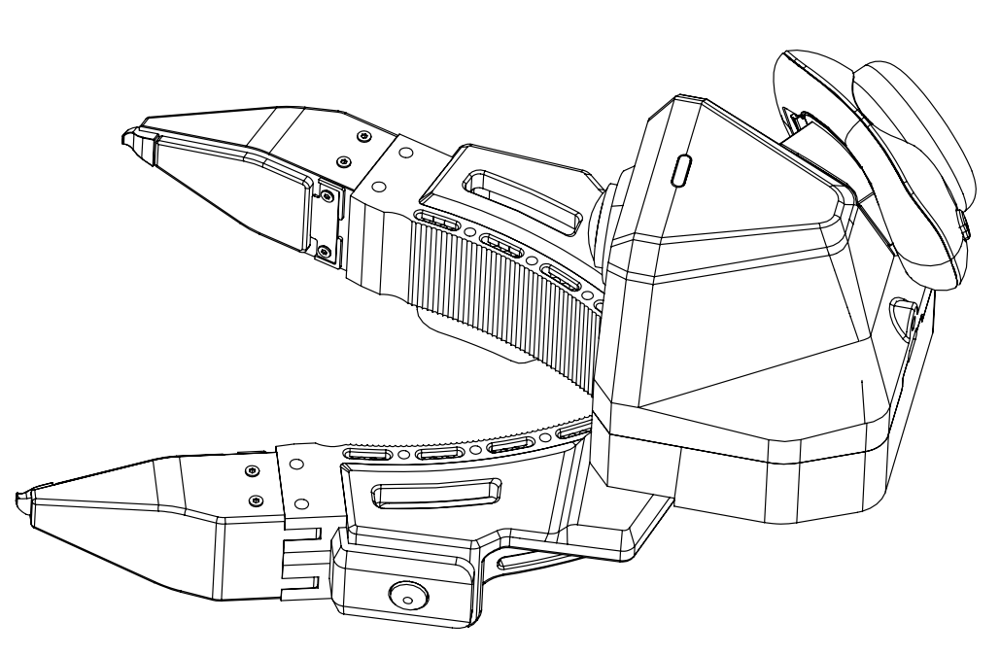
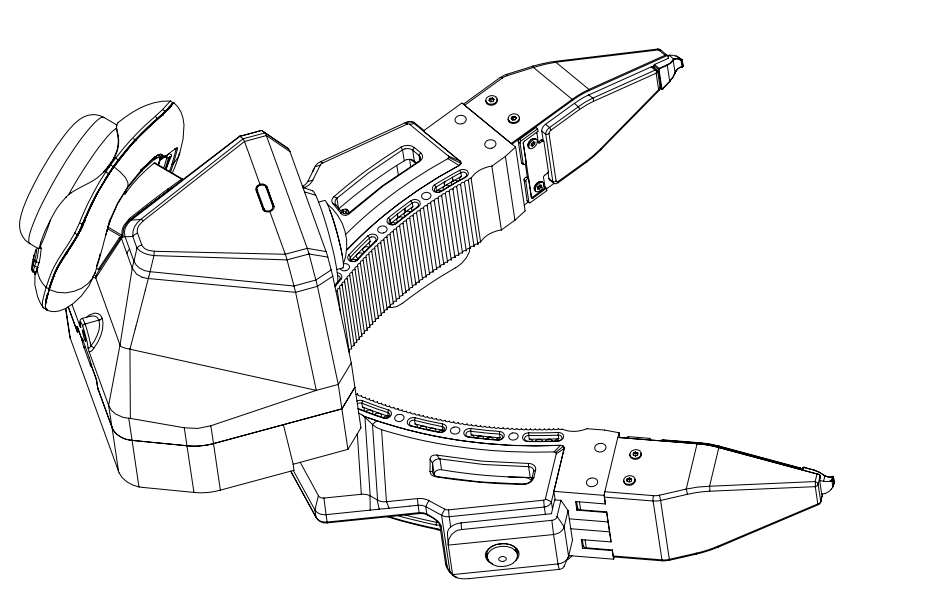
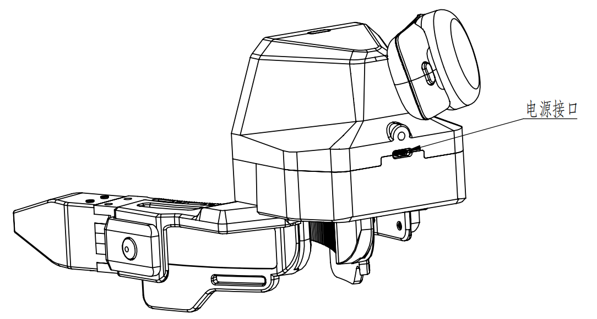
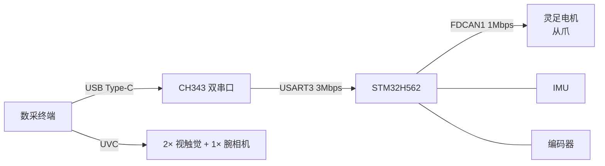
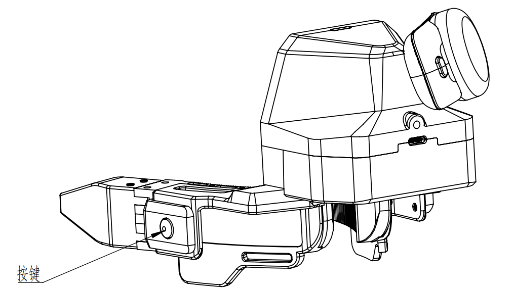
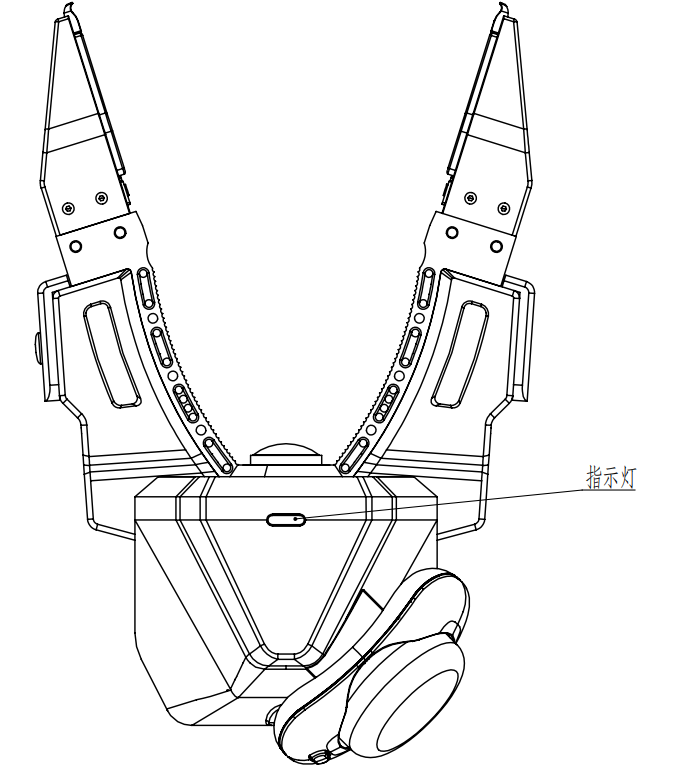
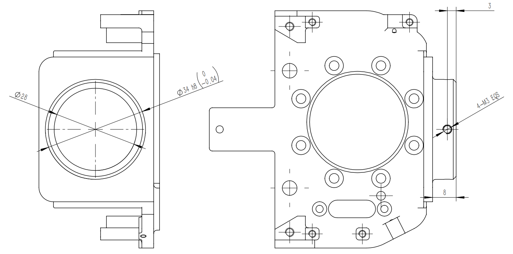

# 硬件介绍

TacCap-Gripper(对外市场名 **千觉 XTac UMI G1**)的机械、电气与操作构成。本章整理自硬件团队
《TC-GU-01 硬件使用说明》框架,面向数采使用的**设备了解与上手**。

!!! info "版本与完善度"
    硬件资料版本 **v1.0.0(夹爪 — 笔记本电脑)**;v2.0.0(夹爪 — 数采背包)待发布。
    本页按硬件团队框架搭建,**标「待补」处**为对方仍在补充的内容(含拆箱图、视触觉拆装、
    数采盒子连接、异常表、OTA 等),到位后接入。

## 部件构成

| 部件 | 说明 | 接口 |
|---|---|---|
| 电机夹爪(motor jaw) | 主爪采集时不上电,手动带动;从爪经 FDCAN 透传灵足电机 | FDCAN1 @ 1 Mbps |
| 编码器(Encoder) | 夹爪开合角(SDK 读数标定后闭合=0);开合规格见 [产品参数](#specs) | MCU |
| IMU | 加速度 / 角速度 / 磁力 / 温度 | MCU |
| 视触觉传感器 ×2 | 左右指各一,三色光视触觉成像 | UVC(`/dev/video*`) |
| 腕部鱼眼相机 | 手腕视角 RGB,超大视场角 | UVC(`/dev/video*`) |
| 主控 MCU(TC-GU-01) | STM32H562 + ThreadX | USB 串口 |

## 主爪与从爪 {#master-follower}

### 主夹爪(区分左右)

主爪通信与供电统一走 **Type-C**;左右按序列号「单左双右」区分(见 [序列号编码规则](#sn))。

=== "主爪 · 左"

    { width="420" }

=== "主爪 · 右"

    { width="420" }

### 从夹爪(不区分左右)

{ width="420" }

从爪的通信与供电**分开**:供电用 **24V 适配器**,通信用 Type-C。

### 视触觉传感器

!!! warning "待补"
    视触觉传感器示意图与拆装说明由硬件团队补充。

## 接口与供电 {#interface}

### 电源 & USB 接口

{ width="520" }

- 夹爪通过配套 **USB Type-C(C-to-C)** 线束连接数据采集终端;整机工作电源由 Type-C 供给,
  标准供电 **DC 5V / 500 mA**。
- 线材**带固定螺钉的一端接夹爪**,插入后拧紧螺钉。

!!! danger "禁止快充直连"
    **禁止使用快充 9V / 12V 适配器直连夹爪**,否则会**烧毁夹爪控制板**。

### 内部通信(技术参考)



- MCU 串口:CH343(`1a86:55d2`),枚举 `/dev/ttyACM*`,USART3 @ 3 Mbps。
- 相机:视触觉与腕相机为 UVC(`/dev/video*`)。

## 按键与指示灯 {#buttons-leds}

### 按键

{ width="420" }

| 按键位置 | 动作 | 功能 |
|---|---|---|
| 主爪 · 左键 | 单击 | **开始录制** |
| | 双击 | 用户自定义 |
| | 长按 | 用户自定义 |
| 主爪 · 右键 | 单击 | 切换下一流程 |
| | 双击 | 重新录制当前回合 |
| | 长按 | 退出当前录制 |

!!! note "与软件采集的联动"
    按键功能为**设备侧定义**;与 `lerobot-record` 采集流程的具体联动以实际集成为准,
    采集操作见 [数据采集](05-data-collection.md)。

### 指示灯

{ width="420" }

| 状态 | 含义 |
|---|---|
| 绿色长亮 | 运行中 |
| 绿色闪烁 | 正在录制 |
| 红色闪烁 | 故障 |
| 蓝色闪烁 | OTA 升级中 |

## 安装与连接 {#install}

### 拆箱

!!! warning "待补"
    拆箱示意图待补充。

### 主爪连接(笔记本电脑)

{ width="640" }

如上图,使用**两根 Type-C to Type-C 线材**,连接左右主爪到数采终端。

!!! note "待补:数采盒子连接(TBD)"
    夹爪 — 数采背包/盒子的整机连接示意图待 v2.0.0 补充。

### 从爪安装

{ width="420" }

- **法兰安装**:按上图将从爪安装到机器人法兰。
- **数据电源线连接**:*待补*。

### 视触觉传感器拆装

!!! warning "待补"
    传感器拆装示意图待补充。

## 上下电步骤 {#power}

### 上电

=== "主爪"

    主爪无单独电源,通信与供电统一用 Type-C:

    1. 将 Type-C 线带螺栓锁扣的一端连接到夹爪本体,旋紧螺栓。
    2. 将另一端连接到数采终端的 Type-C 口。

=== "从爪"

    从爪通信与供电分开(供电 24V 适配器):

    1. 连接夹爪本体端的电源适配器。
    2. 将 Type-C 线带螺栓锁扣的一端连接到夹爪本体。
    3. 将另一端连接到数采终端的 Type-C 口。

### 下电

=== "主爪"

    1. 拔掉数采终端的 Type-C 线。
    2. 松开夹爪本体 Type-C 的锁扣螺栓,拔掉夹爪上的 Type-C 线。

=== "从爪"

    1. 拔掉数采终端的 Type-C 线。
    2. 拔掉夹爪本体的电源适配器。
    3. 拔掉夹爪本体的 Type-C 线。

!!! warning "注意静电"
    上下电过程中注意防静电。

## 序列号编码规则 {#sn}

固件烧录的 SN 同时编码**侧别**与**主从角色**(详见 [3.3 设备发现规则](03-host-hardware.md#33)):

```
TCGU01 A24 Z 0001 m      product: TCGU01夹爪 / GSPS01传感器
└─┬──┘ └┬┘ │ └┬─┘ │       line   : Z=研发/测试, A=量产
product batch│  seq patch  seq    : 末位奇→左, 偶→右(单左双右)
             line          patch  : m=Master(主/Leader), s=Slave(从/Follower)
```

## 产品参数 {#specs}

参数以**市场部对外官方资料为准**(整机能力)。采集时的实际速率可按需配置(例如触觉以较低帧率录制),
属**使用选择**,不改变传感器规格。

### 基础与结构

| 参数项 | 规格 |
|---|---|
| 夹爪类型 | 二指结构 |
| 外形尺寸 | 145 × 186 × 170 mm(长 × 宽 × 高) |
| 重量(主爪) | 约 370 g |
| 最大负载 | 2.5 kg |
| 开合行程 / 角度 | 0–150 mm / -9° 至 +50° |
| 续航 | 3 小时,或使用电源适配器 |
| 供电 | 主爪:USB Type-C,DC 5V/500mA;从爪:24V 适配器(⚠️ 禁快充直连) |
| 通信方式 | USB 2.0(Type-C,C-to-C) |
| 存储 | 本地、上云 |

### 传感、同步与数据

| 参数项 | 规格 |
|---|---|
| 多设备时间同步 | 5 ms |
| 空间定位精度 | < 3 mm |
| 视触觉传感器 | 2 × 三色光视触觉;量程 0–25 N |
| 触觉帧率 / 分辨率 | 120 FPS;640 × 480 MJPG |
| 触觉数据类型 | 原始触觉 / 三维形貌;三维分布力 / 六维合力 |
| IMU | 9 轴,200 Hz |
| 腕部鱼眼相机 | FOV 190°;1920 × 1080 @ 60 FPS MJPG |
| 输出数据类型 | RGB 图像、多模态触觉、夹爪开口角度、IMU、空间定位轨迹 |

!!! note "实际录制速率"
    上表为传感器/整机规格。数采时可配置更低速率(如触觉常以较低帧率录制),
    见 [数据采集 → 录制选项](05-data-collection.md#55)。

## 异常处理

!!! warning "待补"
    硬件异常现象与解决方案待补充(硬件 / 嵌入式 / 结构)。
    软件/采集类问题见 [故障排查](troubleshooting.md);日常保养见 [维护保养](maintenance.md)。

## OTA 升级

!!! note "待补(TBD)"
    固件 OTA 升级流程待补充;SDK 侧 OTA 见 [SDK 示例](sdk-examples.md)。

## 待补清单

- 拆箱示意图
- 视触觉传感器示意与拆装
- 从爪数据电源线连接
- 数采盒子/背包整机连接(v2.0.0)
- 异常处理表(硬件 / 嵌入式 / 结构)
- OTA 升级流程
- 机械爆炸图 → `docs/assets/hardware/`
