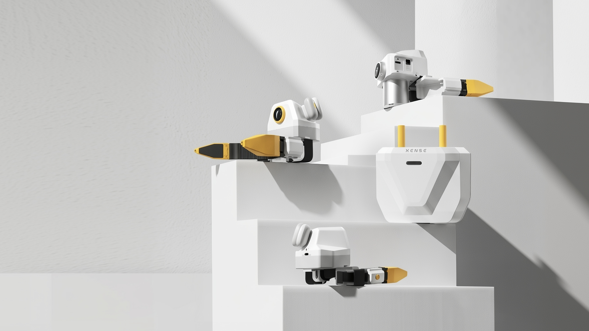

# 产品亮点

**XTac-UMI G1** 是面向机器人操作学习的**穿戴式视触觉多模态数据采集夹爪**,面向具身操作数据集
构建。整机由**穿戴式主端 + 机器人从端 + 采集背包 + 三色光视触觉传感器**组成,集成腕部鱼眼相机、
高精度位姿传感单元与 IMU,可同步采集 RGB 图像、视触觉、空间位姿、夹爪状态与惯性数据,服务于
模仿学习、VLA / VTLA 模型训练与触觉世界模型研究。

{ width="720" }

## 核心价值

-   :material-cash-minus: __降低数据采集成本__

    ---

    主从一体、轻量化设计,把人类操作快速转化为可回放、可训练的高质量接触数据,大幅降低
    单位时间采集成本。

-   :material-hand-back-right-outline: __自然操作、高效采集__

    ---

    穿戴式形态贴近人手自然动作,学习成本低,适合长时间、多任务、规模化采集,提升效率与动作一致性。

-   :material-fingerprint: __高质量视触觉多模态__

    ---

    不止记录"手在动",更能描述"是否接触、哪里接触、如何接触、接触是否稳定"。

-   :material-database-arrow-up-outline: __支撑规模化数据集__

    ---

    轻量部署、批量复制、标准化采集,持续产出高质量视触觉操作数据,面向下一代具身智能模型。

## 六大核心亮点

-   :material-layers-triple-outline: __视触融合感知,采集真实交互__

    ---

    高帧率三色光视触觉传感器,同步获取 RGB、视触觉图像、夹爪状态、位姿与 IMU,为夹取稳定性、
    滑移趋势、接触位置分析提供更丰富数据来源。

-   :material-gesture-tap-hold: __贴近人手操作,提升采集效率__

    ---

    穿戴式主端,更轻、易部署;可完成抓取、搬运、整理、插拔、薄片夹取等多类任务,提升长时间、
    多任务采集的效率与一致性。

-   :material-sync: __高精度同步输出,沉淀高质量数据__

    ---

    多设备时间同步 **5 ms**、空间定位精度 **< 3 mm**,多模态信息与同一操作事件时序对齐,
    结果可回放、可验证、可复用。

-   :material-connection: __打通主流生态,数据即刻可用__

    ---

    原生兼容 **LeRobot、MCAP** 等主流数据格式与工具链,打通采集→管理→标注→回放→数据集构建。

-   :material-bag-personal-outline: __轻量化部署,适配规模采集__

    ---

    主端轻量化 + 背负式采集单元,实验室/办公桌面/家庭/现场灵活部署;从小规模验证到
    百/千小时级数据集建设皆可扩展。

-   :material-gesture-tap-button: __柔顺指尖设计,增强精细夹取__

    ---

    细巧柔顺指尖结构,提升对小物件、薄片、边缘物体的接触适应性,更贴近人手处理细小物体的动作逻辑。

## 产品外观

## 应用场景

- **具身智能数据工厂** —— 多工位、多人员、多任务的大规模操作数据采集。
- **机器人算法研发平台** —— 为机器人公司、高校实验室、具身团队提供真实交互数据入口。
- **家庭与服务机器人** —— 桌面整理、物品取放、容器开合、工具使用等日常操作。
- **工业柔性操作** —— 3C 装配、小件分拣、线缆插拔、零件取放。
- **触觉数据与真实交互研究** —— 接触状态理解、触觉表征与触觉基础模型研究。

## 对客户与行业的价值

- **缩短"操作演示 → 训练"的数据链路**:采集、同步、多模态与工具链接入放在同一系统。
- **让数据从"可观看"走向"可理解"**:记录接触形貌、位姿轨迹与夹爪状态,贴近真实操作的因果关系。
- **提升数据质量、一致性与可追溯性**:时序同步 + 空间定位 + 结构化输出,便于回看、比对、切片、复用。

!!! note "完整规格"
    产品参数见 [硬件介绍 → 产品参数](hardware.md#specs)。部分参数口径以官方最新信息为准。
