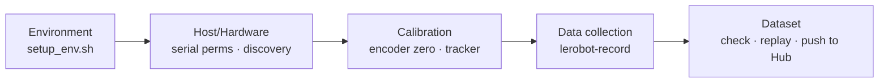

---
hide:
  - navigation
  - toc
---

XenseRobotics · XTac-UMI G1

# Handheld tactile data collection, from unboxing to a dataset

XTac-UMI G1 handheld tactile gripper × Pico4 Ultra tracker capture synchronized vision · tactile · pose data with lerobot, straight to a training-ready <code>LeRobotDataset</code>

[Quickstart :material-arrow-right-bold:](quickstart.md){ .md-button .md-button--primary }
[Installation](02-environment.md){ .md-button }
[About the device](01-overview.md){ .md-button }

{ .tc-hero-img }

## The whole flow in 5 minutes

## Three steps

This is the **xense-taccap-lerobot data-collection quickstart**. Three parts: **get ready → record → understand the data**.

-   :material-check-decagram-outline: __① Getting Ready (prerequisites)__

    ---

    Know your hardware → connect & power it on → set up the software environment and host/device config.

    [:octicons-arrow-right-24: Hardware](hardware.md) · [Environment Setup](02-environment.md)

-   :material-record-circle-outline: __② Software Usage__

    ---

    Calibration → `lerobot-record`. The core data-collection workflow.

    [:octicons-arrow-right-24: Data Collection](05-data-collection.md)

-   :material-database-outline: __③ Data__

    ---

    What a `LeRobotDataset` looks like, what's recorded per frame, checking & upload.

    [:octicons-arrow-right-24: Dataset & Examples](06-dataset.md)

## Related repositories

| Repo / package | Role |
|---|---|
| [`xense-taccap-lerobot`](https://github.com/Vertax42/xense-taccap-lerobot) | Data-collection repo (lerobot v5.1 fork, `taccap_gripper` robot class) |
| `xense.taccap` (`taccap-gripper` SDK) | Gripper device driver: IMU / encoder / wrist camera / protocol |
| `xensevr_pc_service_sdk` | Pico4 teleop / tracker PC service SDK |
| `xensesdk` | Visuotactile (OG) imaging & rectification (PyPI) |
