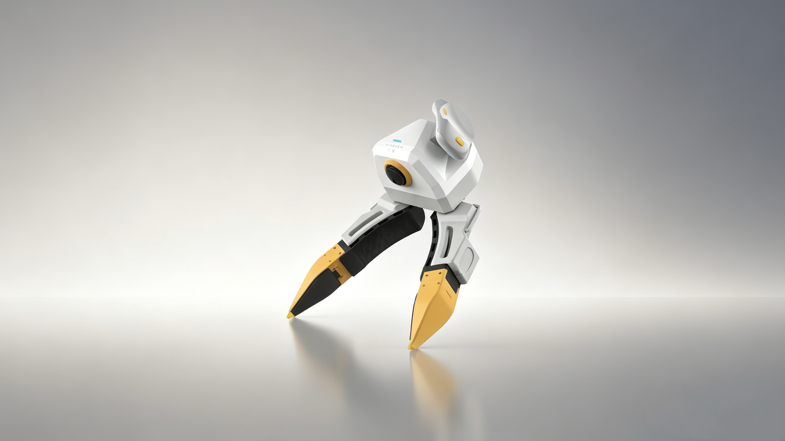
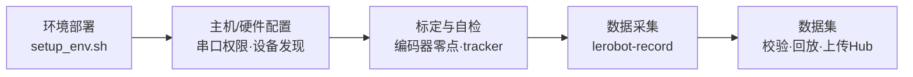

---
hide:
  - navigation
  - toc
---

XenseRobotics · TacCap-Gripper

# 手持触觉数采,从开箱到数据集

TacCap-Gripper 手持触觉数采夹爪 × Pico4 Ultra 追踪器 —— 基于 lerobot 同步采集视觉 · 触觉 · 位姿多模态数据,直出可训练的标准 <code>LeRobotDataset</code>

[一页速通 :material-arrow-right-bold:](quickstart.md){ .md-button .md-button--primary }
[环境安装](02-environment.md){ .md-button }
[了解设备](01-overview.md){ .md-button }

{ .tc-hero-img }

## 5 分钟看懂全流程

## 三步走

本手册是 **xense-taccap-lerobot 数采快速使用文档**,主线就三块:**装好环境 → 用软件采集 → 认识数据**。

-   :material-download-box-outline: __① 环境安装__

    ---

    Mamba 环境、克隆子模块、`setup_env.sh` 一键装好、主机与设备配置。

    [:octicons-arrow-right-24: 环境部署](02-environment.md)

-   :material-record-circle-outline: __② 软件使用__

    ---

    标定自检 → `lerobot-record` 录制。数采的核心操作。

    [:octicons-arrow-right-24: 数据采集](05-data-collection.md)

-   :material-database-outline: __③ 数据介绍__

    ---

    `LeRobotDataset` 长什么样、每帧记录了什么、如何校验与上传。

    [:octicons-arrow-right-24: 数据集与示例](06-dataset.md)

-   :material-chip: __设备与硬件__

    ---

    先了解这台手持数采夹爪的构成与接口(硬件只是其中一章)。

    [:octicons-arrow-right-24: 概述](01-overview.md) · [硬件介绍](hardware.md)

!!! note "二次开发?"
    需要直接调 `xense.taccap` SDK 的,见 [参考 → 附录:SDK 与二次开发](sdk-overview.md)。

## 相关仓库

| 仓库 / 包 | 作用 |
|---|---|
| [`xense-taccap-lerobot`](https://github.com/Vertax42/xense-taccap-lerobot) | 数采主仓库(lerobot v5.1 fork,含 `taccap_gripper` 机器人类) |
| `xense.taccap`(`taccap-gripper` SDK) | 夹爪底层驱动:IMU / 编码器 / 腕相机 / 协议 |
| `xensevr_pc_service_sdk` | Pico4 遥操 / 追踪器 PC 服务 SDK |
| `xensesdk` | 视触觉(OG)传感器成像与校正(PyPI 安装) |

!!! note "适用版本"
    本手册对应 `xense.taccap ≥ 0.1.0`、`xense-taccap-lerobot` 跟踪上游 **lerobot v5.1**。
    命令与字段以你本地 checkout 的 `src/lerobot/robots/taccap_gripper/README.md` 为准。
