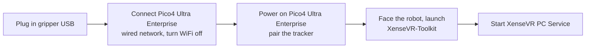

# Quickstart (TL;DR)

Already prepared — device understood, cables in, environment installed? This page
takes you **from power-on to your first episode**, copy-paste as-is. First time
through, do [Getting Ready](hardware.md) first: [Hardware](hardware.md) →
[Installation](02-environment.md) → [Host & Device Setup](03-host-hardware.md),
then come back.

!!! danger "Check your versions first — repo, SDK and firmware must all be current"
    On a mismatched stack, collection **still runs to completion and writes a dataset**; only
    `gripper.pos` ends up on a scale that does not match anyone else's, and nothing in the data
    shows it. One-off upgrade steps → [Required versions](versions.md#required).

!!! note "Prerequisites (Getting Ready)"
    - Device understood, **hardware connected and powered** (see [Hardware](hardware.md#install)).
    - Repo, submodules and **gripper firmware (V2.1)** upgraded per
      [Required versions](versions.md#required).
    - [Installation](02-environment.md) done — either path, with all three SDK packages importing.
    - [Serial permissions + ModemManager](03-host-hardware.md#31) one-off host setup done.
    - `gripper.pos` reaches **1.0** wide open. If it does not, run
      [gripper calibration](04-calibration.md#41) first — **once per leader gripper**, zero +
      travel span, and both sides of a bimanual rig (calibrating one leaves the two channels on
      different scales).
    - You are inside the collection environment: `mamba activate xense-taccap` on the conda
      path, or `docker compose run --rm xense-taccap` on the Docker one.

## 1. Power-on order



```bash
/opt/apps/roboticsservice/runService.sh    # start the XenseVR PC Service
```

!!! danger "Turn the host's WiFi off while collecting"
    The Pico4 Ultra Enterprise uses a **wired shared network**. Host WiFi conflicts with it and
    makes tracking unstable or unreachable. Turn WiFi off on the collection host for the whole
    session. See [3.4 Network](03-host-hardware.md#pico-network).

!!! warning "Never restart XenseVR-Toolkit mid-session"
    Restarting resets the world origin, which leaves poses inside one dataset referenced to
    different frames.

## 2. Self-check (devices ready)

```bash
# Grippers readable: role should be Leader/Follower, firmware_sn non-empty
python -c "from xense.taccap import scan_grippers
for g in scan_grippers(): print(g.side.name, g.role.name, repr(g.firmware_sn))"
```

Anything wrong → [Troubleshooting](troubleshooting.md).

## 3. Preview the live streams

Before recording, open Rerun with `lerobot-teleoperate` and confirm tactile, jaw opening and
pose all look right.

**Single gripper (right side shown):**

```bash
lerobot-teleoperate \
    --robot.type=taccap_gripper \
    --robot.side=right \
    --fps=30 \
    --display_data=true
```

**Bimanual:**

```bash
lerobot-teleoperate \
    --robot.type=bi_taccap_gripper \
    --fps=30 \
    --display_data=true
```

Move the gripper and work the jaw to check every stream. `Ctrl+C` to leave the preview.

!!! tip "Check `gripper.pos` here, not after recording"
    In the scalar panel, a fully open jaw should read **1.0** and fully closed **0.0**. Topping
    out below 1.0 (e.g. 0.68) means that unit's travel span was never calibrated — see
    [4.1 Gripper calibration](04-calibration.md#41). Nothing downstream will flag this for you.

## 4. Record one episode

**Single gripper (right side shown):**

```bash
lerobot-record \
    --robot.type=taccap_gripper \
    --robot.side=right \
    --display_data=true \
    --dataset.repo_id=<your_org>/<dataset_name> \
    --dataset.num_episodes=1 \
    --dataset.fps=30 \
    --dataset.push_to_hub=false \
    --dataset.episode_time_s=120 \
    --dataset.reset_time_s=60 \
    --dataset.single_task='Pick up the object'
```

**Bimanual:**

```bash
lerobot-record \
    --robot.type=bi_taccap_gripper \
    --display_data=true \
    --dataset.repo_id=<your_org>/<dataset_name> \
    --dataset.num_episodes=1 \
    --dataset.fps=30 \
    --dataset.push_to_hub=false \
    --dataset.episode_time_s=120 \
    --dataset.reset_time_s=60 \
    --dataset.single_task='Pick up the object'
```

Three that are easy to get wrong:

- `--robot.side` is only needed when **both grippers are plugged in**; a lone unit auto-resolves.
- `--fps` is the main loop rate, `--dataset.fps` is the recording sample rate — **two parameters**,
  usually set to the same value.
- Pose is recorded by default; add `--robot.enable_tracker=false` only when you do not want it.

Every parameter (dataset / recording control / device) → [5.2 Parameter reference](05-data-collection.md#params)

## 5. Check the local dataset

Use the same `repo_id` you recorded with to verify the local dataset's structure and contents.

```bash
lerobot-check-dataset --repo-id <your_org>/<dataset_name>
```

## 6. (Optional) Push to the Hub

```bash
lerobot-push-dataset-to-hub \
    --repo-id <your_org>/<dataset_name> \
    --dataset-path ~/.cache/huggingface/lerobot/<your_org>/<dataset_name> \
    --upload-large-folder
```

What the dataset looks like and what each frame holds → [Dataset & examples](06-dataset.md).
