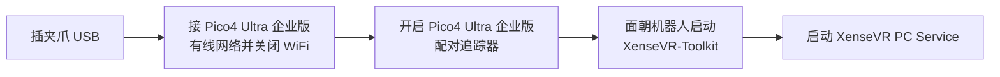

# 一页速通(TL;DR)

已经做完准备工作(认识硬件、连好线、装好环境)?这一页从**上电到出第一条数据**,照抄即可。
第一次用请先走 [准备工作](hardware.md):[硬件介绍](hardware.md) → [环境安装](02-environment.md) →
[主机与设备配置](03-host-hardware.md),再回来。

!!! note "前提(准备工作)"
    - 已了解设备并**连接好硬件、上电**(见 [硬件介绍](hardware.md#install))。
    - 已完成 [环境安装](02-environment.md)(`setup_env.sh --install` 通过、三个包能 import)。
    - 已做 [串口权限 + ModemManager](03-host-hardware.md#31) 一次性主机配置。
    - 已 [标定编码器零点](04-calibration.md#41)。
    - `mamba activate xense-taccap`。

## 1. 上电顺序



```bash
/opt/apps/roboticsservice/runService.sh    # 启动 XenseVR PC Service
```

!!! danger "数采时关闭电脑 WiFi"
    Pico4 Ultra 企业版走**有线共享网络**,电脑 WiFi 会与之冲突导致追踪不稳/连不上。数采期间关闭数采电脑 WiFi。
    见 [3.4 网络连接](03-host-hardware.md#pico-network)。

!!! warning "采集全程不要重启 XenseVR-Toolkit"
    重启会重设世界原点,导致同一数据集内位姿参考系不一致。

## 2. 自检(确认设备就绪)

```bash
# 夹爪可读:role 应为 Leader/Follower,firmware_sn 非空
python -c "from xense.taccap import scan_grippers
for g in scan_grippers(): print(g.side.name, g.role.name, repr(g.firmware_sn))"
```

出问题看 [故障排查](troubleshooting.md)。

## 3. 预览实时数据

录制前先用 `lerobot-teleoperate` 打开 Rerun,确认触觉、夹爪开度和位姿数据正常。

**单夹爪(以右侧为例):**

```bash
lerobot-teleoperate \
    --robot.type=taccap_gripper \
    --robot.side=right \
    --fps=30 \
    --display_data=true
```

**双夹爪:**

```bash
lerobot-teleoperate \
    --robot.type=bi_taccap_gripper \
    --fps=30 \
    --display_data=true
```

移动并开合夹爪检查各路数据;确认无误后按 `Ctrl+C` 退出预览。

## 4. 录制一条数据

**单夹爪(以右侧为例):**

```bash
lerobot-record \
    --robot.type=taccap_gripper \
    --robot.side=right \
    --display_data=true \
    --dataset.repo_id=<你的org>/<数据集名> \
    --dataset.num_episodes=1 \
    --dataset.fps=30 \
    --dataset.push_to_hub=false \
    --dataset.episode_time_s=120 \
    --dataset.reset_time_s=60 \
    --dataset.single_task='Pick up the object'
```

**双夹爪:**

```bash
lerobot-record \
    --robot.type=bi_taccap_gripper \
    --display_data=true \
    --dataset.repo_id=<你的org>/<数据集名> \
    --dataset.num_episodes=1 \
    --dataset.fps=30 \
    --dataset.push_to_hub=false \
    --dataset.episode_time_s=120 \
    --dataset.reset_time_s=60 \
    --dataset.single_task='Pick up the object'
```

- `--robot.side=right` 指定右侧夹爪,并参与按侧别发现和匹配设备序列号。
- 位姿默认会**自动录制**;如不需要,可添加 `--robot.enable_tracker=false`。
- `--fps=30` 控制预览帧率;`--dataset.fps=30` 控制录制采样帧率。
- `--display_data=true` 会在录制过程中打开实时 Rerun 可视化。
- `--dataset.push_to_hub=false` 表示仅保存到本地,不自动上传 Hugging Face Hub。

!!! info "lerobot-record 参数详细说明"
    `lerobot-record` 的完整参数定义与用法请查阅 [LeRobot v0.6.0 官方 Record function 文档](https://huggingface.co/docs/lerobot/v0.6.0/en/il_robots#record-function)。
    本项目的设备参数与采集说明见 [数据采集](05-data-collection.md)。

## 5. 检查本地数据完整性

使用与录制时相同的 `repo_id`,检查本地数据集结构与内容是否完整。

```bash
lerobot-check-dataset --repo-id <你的org>/<数据集名>
```

## 6.(可选)上传 Hub

```bash
python push_dataset_to_hub.py \
    --repo-id <你的org>/<数据集名> \
    --dataset-path ~/.cache/huggingface/lerobot/<你的org>/<数据集名> \
    --upload-large-folder
```

数据集长什么样、每帧记录了什么 → [数据集与示例](06-dataset.md)。
