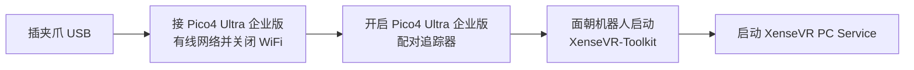

# 一页速通(TL;DR)

已经做完准备工作(认识硬件、连好线、装好环境)?这一页从**上电到出第一条数据**,照抄即可。
第一次用请先走 [准备工作](hardware.md):[硬件介绍](hardware.md) → [环境安装](02-environment.md) →
[主机与设备配置](03-host-hardware.md),再回来。

!!! danger "先确认版本:仓库 / SDK / 固件都必须是最新"
    版本不配套时采集**照样能跑完并落盘**,只是 `gripper.pos` 的刻度和别人对不上,
    事后从数据里看不出来。一次性升级步骤 → [必须升级到最新版本](versions.md#required)。

!!! note "前提(准备工作)"
    - 已了解设备并**连接好硬件、上电**(见 [硬件介绍](hardware.md#install))。
    - 已按 [版本要求](versions.md#required) 升级仓库、子模块与**夹爪固件**——固件要求的是
      **命令集 V2.1**,对应构建号 **主夹爪 ≥ 1.2.0 / 从夹爪 ≥ 1.1.0**(更高版本同样支持,
      不必回刷;[两者的区别](versions.md#v21))。
    - 已完成 [环境安装](02-environment.md)——Docker 或 conda 任选一条,三个 SDK 包都能 import。
    - 已做 [串口权限 + ModemManager](03-host-hardware.md#31) 一次性主机配置。
    - 每台主夹爪已做过[夹爪标定](04-calibration.md#41)(零点 + 行程上限,一台一次)。
      **没标定的主夹爪会被拒绝连接**;双臂两侧都要标,只标一侧会让左右刻度不一致。
    - 已进入采集环境:conda 路径执行 `mamba activate xense-taccap`;Docker 路径执行
      `docker compose run --rm xense-taccap` 进容器。

## 1. 上电顺序


```mermaid
flowchart LR
    A[插夹爪 USB] --> N[接 Pico4 Ultra 企业版<br/>有线网络并关闭 WiFi] --> B[开启 Pico4 Ultra 企业版<br/>配对追踪器] --> C[面朝机器人启动<br/>XenseVR-Toolkit] --> D[启动 XenseVR PC Service]
```

```bash
/opt/apps/roboticsservice/runService.sh    # 启动 XenseVR PC Service
```

!!! danger "数采时关闭电脑 WiFi"
    Pico4 Ultra 企业版走**有线共享网络**,电脑 WiFi 会与之冲突导致追踪不稳/连不上。数采期间关闭数采电脑 WiFi。
    见 [3.4 网络连接](03-host-hardware.md#pico-network)。

!!! warning "采集全程不要重启 XenseVR-Toolkit"
    重启会重设世界原点,导致同一数据集内位姿参考系不一致。

## 2. 自检(确认设备就绪)

```bash
# 夹爪可读:role 应为 Leader/Follower,firmware_sn 非空
python -c "from xense.taccap import scan_grippers
for g in scan_grippers(): print(g.side.name, g.role.name, repr(g.firmware_sn))"
```

出问题看 [故障排查](troubleshooting.md)。

## 3. 预览实时数据

录制前先用 `lerobot-teleoperate` 打开 Rerun 确认数据流。**分三档**,每一档比上一档多接一层设备
——**你要录到哪一档,就预览到哪一档**。

=== "① 只看夹爪"

    触觉两路、腕相机、`gripper.pos`。追踪器和头显都关着,**不需要启动 PC Service**。

    这一档就能**上手感受触觉**:用手指按压左右指的视触觉传感器,Rerun 里对应画面的纹理会
    随压力明显起伏,松手即恢复;开合夹爪则看 `gripper.pos` 能否张到 **1.0**、闭到 **0.0**。

    ```bash
    lerobot-teleoperate \
        --robot.type=bi_taccap_gripper \
        --robot.enable_tracker=false \
        --robot.enable_head_camera=false \
        --fps=30 \
        --display_data=true
    ```

=== "② 加上追踪器位姿"

    Rerun 里多出 `/world` 3D 视图:夹爪的 EE 标记,以及它走过的**轨迹**。

    **启动脚本前先把追踪器摆进头显视野内。**独立追踪靠头显看着追踪器,被身体、桌沿或另一只手
    遮挡就会丢跟踪,表现为位姿跳变或卡住(见
    [绑定运动追踪器](03-host-hardware.md#pico-tracker-bind))。

    还需要追踪器已开机、Pico4 已连上、[XenseVR PC Service](03-host-hardware.md#35) 已启动。

    ```bash
    lerobot-teleoperate \
        --robot.type=bi_taccap_gripper \
        --robot.enable_tracker=true \
        --robot.enable_head_camera=false \
        --fps=30 \
        --display_data=true
    ```

=== "③ 全开(含头显相机)"

    再多出头显双目画面与头部位姿。需要 **PC Service ≥ v0.2.0 且主机为 amd64**
    → [5.7 头显相机](05-data-collection.md#57)。

    ```bash
    lerobot-teleoperate \
        --robot.type=bi_taccap_gripper \
        --robot.enable_tracker=true \
        --robot.enable_head_camera=true \
        --fps=30 \
        --display_data=true
    ```

**只有一只夹爪时**:把 `--robot.type` 换成 `taccap_gripper` 并加上 `--robot.side=left|right`,其余相同。

移动并开合夹爪检查各路数据;确认无误后按 `Ctrl+C` 退出预览。录制命令用哪一档,预览就用哪一档。

## 4. 录制一条数据

```bash
lerobot-record \
    --robot.type=bi_taccap_gripper \
    --robot.enable_head_camera=false \
    --display_data=true \
    --dataset.repo_id=<你的org>/<数据集名> \
    --dataset.num_episodes=1 \
    --dataset.fps=30 \
    --dataset.push_to_hub=false \
    --dataset.episode_time_s=120 \
    --dataset.reset_time_s=60 \
    --dataset.single_task='Pick up the object'
```

**只有一只夹爪时**:`--robot.type=taccap_gripper` 并加 `--robot.side=left|right`,其余相同。

三个容易搞错的:

- `--robot.side` 只在单夹爪模式、且**两只夹爪都接着**时才需要;单只会自动选中。
- `--fps` 是主循环帧率,`--dataset.fps` 是落盘采样率——**两个参数**,通常设成一样。
- 位姿默认就录;不需要时才加 `--robot.enable_tracker=false`。

全部参数(数据集 / 录制控制 / 设备三类)→ [5.2 参数详解](05-data-collection.md#params)

## 5. 检查本地数据完整性

使用与录制时相同的 `repo_id`,检查本地数据集结构与内容是否完整。

```bash
lerobot-check-dataset --repo-id <你的org>/<数据集名>
```

## 6.(可选)上传 Hub

```bash
lerobot-push-dataset-to-hub \
    --repo-id <你的org>/<数据集名> \
    --dataset-path ~/.cache/huggingface/lerobot/<你的org>/<数据集名> \
    --upload-large-folder
```

数据集长什么样、每帧记录了什么 → [数据集与示例](06-dataset.md)。
