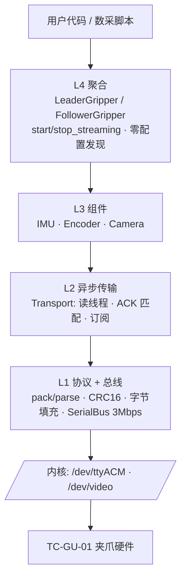

# SDK 概览

`xense.taccap`(`taccap-gripper` SDK)是 XTac-UMI G1 的 **C++17 / Python 设备访问层**,
统一命名空间 `xense::taccap::` / `xense.taccap`。数采主仓库通过
`third_party/taccap-gripper` 子模块消费它,不重复实现底层通信。

!!! note "能力边界"
    SDK 只负责**夹爪协议 + 腕部相机**:IMU / 编码器读取、电机控制(从爪)、主/从聚合对象、
    零配置发现、独立腕相机。**视触觉(OG)成像不在本 SDK**——在 Python 层由 `xensesdk` 完成。

## 分层架构

| 层 | 职责 |
|---|---|
| **L4 聚合** | `LeaderGripper` / `FollowerGripper`:拥有 Transport + 组件,生命周期管理,`open()` 按 MCU 序列号自动发现 |
| **L3 组件** | `IMU` / `Encoder` / `Camera`:`read_once()` 同步读、`on_data(cb)` 流式订阅 |
| **L2 传输** | 异步 `Transport`:后台读线程、ACK 匹配(seq→promise)、按命令订阅 DATA |
| **L1 协议/总线** | 帧打包解析、CRC16、字节填充、`SerialBus`(termios @ 3 Mbps) |

## 两个可消费面

| 产物 | 用途 |
|---|---|
| `libtaccap_core.so`(C++ 共享库) | 集成进 ROS2 包或其他 CMake 工程 |
| `xense.taccap`(Python 扩展) | 数采脚本、Jupyter、上层产品(本手册主用) |

二者由**同一套顶层 CMake** 构建,按需选择。安装见 [安装与构建](sdk-install.md)。

## 线程模型

- 回调在**生产者线程**(读线程 / 采集线程)触发。
- Python 回调重新获取 GIL;回调内异常经 `discard_as_unraisable` 上报,不会拖垮生产者。
- `LeaderGripper` 不可拷贝/移动;`open()` 返回 `unique_ptr`,析构时 `stop_streaming()` 并 join 线程。

## 不属于本 SDK 的部分

数据集录制、时间对齐、分集、ROS2 节点、lerobot Robot 适配、上层遥操/回放,都在**各自的
上层仓库**实现(如本手册对应的 `xense-taccap-lerobot`)。保持 SDK 精简,便于各消费方按需取用。
